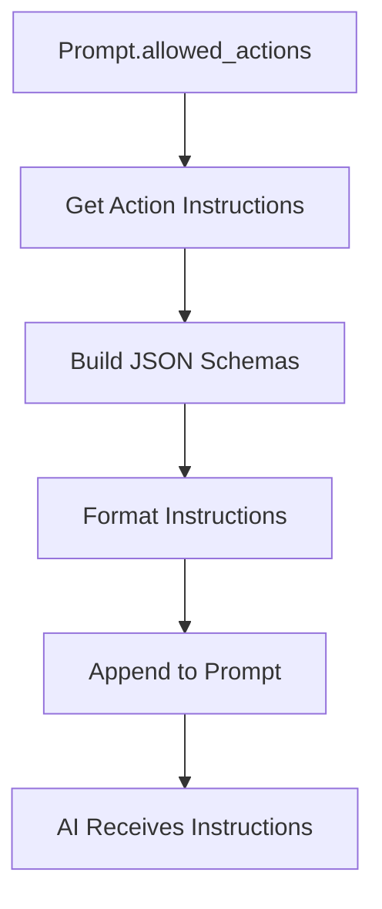
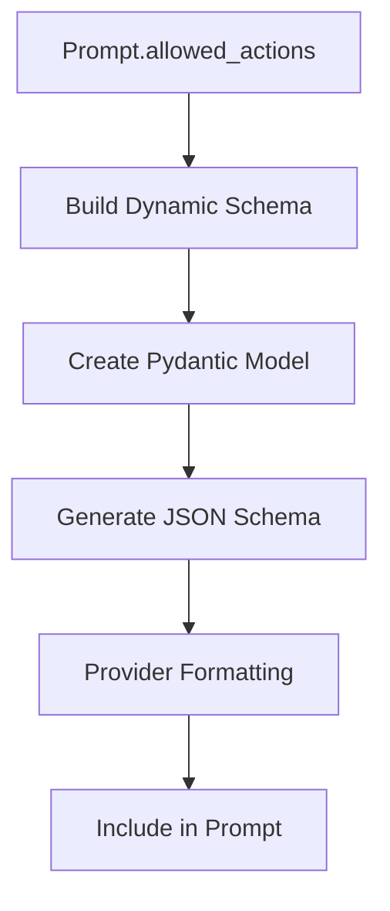
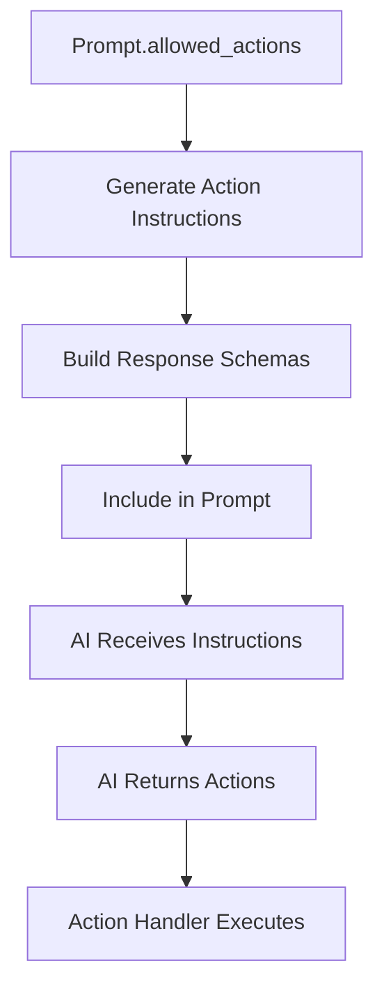

# Action System Integration

The Action System Integration enables the Prompt Manager to control what actions the AI can perform during each interaction. This system ensures that AI responses are properly structured and that only appropriate actions are available for each coaching phase.

## Action Control Overview

The action system integration serves three primary purposes:

1. **Action Limitation**: Restricts AI to only perform actions appropriate for the current coaching phase
2. **Response Structuring**: Ensures AI responses include properly formatted action data
3. **Dynamic Schema Generation**: Creates provider-specific response schemas for allowed actions

## Action Types

The system supports 22 different action types, organized into functional categories.

### Identity Management Actions

| Action Type | Description | Purpose |
|-------------|-------------|---------|
| `create_identity` | Create a new identity | Add new identity to user's collection |
| `update_identity` | Update existing identity | Modify identity details |
| `update_identity_name` | Update identity name | Change identity name |
| `update_identity_affirmation` | Update identity affirmation | Modify identity affirmation |
| `update_identity_visualization` | Update identity visualization | Modify identity visualization |
| `accept_identity` | Accept identity | Mark identity as accepted |
| `accept_identity_refinement` | Accept identity refinement | Accept refined identity |
| `accept_identity_affirmation` | Accept identity affirmation | Accept identity affirmation |
| `accept_identity_visualization` | Accept identity visualization | Accept identity visualization |
| `add_identity_note` | Add note to identity | Add notes to identity |

### Phase Control Actions

| Action Type | Description | Purpose |
|-------------|-------------|---------|
| `transition_phase` | Move to next phase | Advance coaching process |

### User Data Actions

| Action Type | Description | Purpose |
|-------------|-------------|---------|
| `update_who_you_are` | Update self-description | Modify user's self-perception |
| `update_who_you_want_to_be` | Update aspirations | Modify user's goals |
| `update_asked_questions` | Update asked questions | Track questions asked |

### Identity Focus Actions

| Action Type | Description | Purpose |
|-------------|-------------|---------|
| `select_identity_focus` | Select identity to focus on | Set current identity focus |
| `set_current_identity` | Set current identity | Set active identity |

### Category Control Actions

| Action Type | Description | Purpose |
|-------------|-------------|---------|
| `skip_identity_category` | Skip identity category | Skip current category |
| `unskip_identity_category` | Unskip identity category | Re-enable skipped category |

### Note Management Actions

| Action Type | Description | Purpose |
|-------------|-------------|---------|
| `add_user_note` | Add user note | Add personal notes |
| `update_user_note` | Update user note | Modify existing notes |
| `delete_user_note` | Delete user note | Remove notes |

## Action Instruction Generation

The system generates specific instructions for each allowed action, including JSON schemas for proper response formatting.

### Action Instruction Flow



### Action Instruction Function

```python
def append_action_instructions(
    system_message: str,
    allowed_actions: Optional[List[ActionType]] = ActionType.get_all_actions(),
) -> str:
    """Append filtered action instructions to a system message."""
    action_instructions = get_action_instructions(allowed_actions)
    return f"{system_message}\n\n{action_instructions}"
```

## Dynamic Response Schema Generation

The system dynamically generates response schemas based on the allowed actions for each prompt.

### Schema Generation Process



### Schema Generation Function

```python
response_format_model = build_dynamic_response_format(prompt.allowed_actions)
```

## Action Control by Coaching Phase

Different coaching phases allow different sets of actions to ensure appropriate AI behavior.

### Phase-Specific Action Sets

| Coaching Phase | Typical Allowed Actions |
|----------------|------------------------|
| `GET_TO_KNOW_YOU` | `update_who_you_are`, `update_who_you_want_to_be`, `transition_phase` |
| `IDENTITY_BRAINSTORMING` | `create_identity`, `skip_identity_category`, `transition_phase` |
| `IDENTITY_REFINEMENT` | `update_identity`, `accept_identity_refinement`, `transition_phase` |
| `IDENTITY_AFFIRMATION` | `update_identity_affirmation`, `accept_identity_affirmation`, `transition_phase` |
| `IDENTITY_VISUALIZATION` | `update_identity_visualization`, `accept_identity_visualization`, `transition_phase` |

### Action Restriction Benefits

1. **Phase-Appropriate Behavior**: AI can only perform actions relevant to the current phase
2. **Process Control**: Ensures coaching process follows intended flow
3. **Data Integrity**: Prevents inappropriate data modifications
4. **User Experience**: Provides focused, relevant interactions

## Action Instruction Format

Action instructions include both human-readable instructions and machine-readable schemas.

### Instruction Structure

```
Available Actions:
- create_identity: Create a new identity for the user
  Parameters: name (string), description (string), category (string)

- update_identity: Update an existing identity
  Parameters: identity_id (string), name (string), description (string)

Response Format:
{
  "message": "Your response message",
  "actions": [
    {
      "action_type": "create_identity",
      "parameters": {
        "name": "Identity Name",
        "description": "Identity Description",
        "category": "Category"
      }
    }
  ]
}
```

## Provider-Specific Action Formatting

Different AI providers require different formatting for action instructions and response schemas.

### OpenAI Formatting

For OpenAI, the response schema is passed separately from the prompt:

```python
if provider == AIProvider.OPENAI:
    # Response schema passed separately to OpenAI API
    pass
```

### Anthropic Formatting

For Anthropic, the response schema is embedded in the prompt text:

```python
elif provider == AIProvider.ANTHROPIC:
    response_format_schema = response_format.model_json_schema()
    prompt_body += f"\n\nYour response must be in the form of a JSON object.\n{response_format_schema}"
```

## Action Validation

The system validates action data to ensure proper execution.

### Action Type Validation

```python
def validate_action_type(action_type: str) -> bool:
    try:
        ActionType.from_string(action_type)
        return True
    except ValueError:
        return False
```

### Parameter Validation

Each action type has specific parameter requirements that are validated:

```python
def validate_action_parameters(action_type: ActionType, parameters: dict) -> bool:
    required_params = get_required_parameters(action_type)
    return all(param in parameters for param in required_params)
```

## Action Fallback Handling

The system includes fallback mechanisms for action control.

### Default Action Set

If no allowed actions are specified, the system falls back to all available actions:

```python
if prompt.allowed_actions:
    coach_prompt = append_action_instructions(coach_prompt, prompt.allowed_actions)
else:
    log.warning(f"Prompt {prompt.id} has no allowed actions. Using all action instructions.")
    coach_prompt = append_action_instructions(coach_prompt, ActionType.get_all_actions())
```

### Action Instruction Retrieval

Action instructions are retrieved from a centralized source:

```python
def get_action_instructions(allowed_actions: List[ActionType]) -> str:
    # Retrieve action instructions from centralized source
    # Include JSON schemas for each action type
    pass
```

## Action System Benefits

The action system integration provides several key benefits:

### Controlled AI Behavior

- **Predictable Responses**: AI responses follow expected patterns
- **Phase-Appropriate Actions**: Only relevant actions are available
- **Data Consistency**: Actions maintain data integrity

### Development Benefits

- **Easy Testing**: Specific action sets can be tested
- **Version Control**: Action sets can be versioned with prompts
- **Debugging**: Clear action boundaries for troubleshooting

### User Experience Benefits

- **Focused Interactions**: Users receive relevant, focused responses
- **Process Guidance**: AI guides users through proper coaching flow
- **Consistent Behavior**: Predictable AI behavior across sessions

## Integration with Action Handler

The action system provides action instructions and schemas to the AI, but actual action execution is handled by the Action Handler service (documented separately).

### Action Instruction Flow



### Action Handler Integration

The Prompt Manager provides action instructions and response schemas to the AI. The actual execution of actions returned by the AI is handled by the Action Handler service, which is documented separately.

## Error Handling

The action system includes comprehensive error handling.

### Invalid Action Handling

```python
def handle_invalid_action(action_type: str, error: Exception):
    log.error(f"Invalid action {action_type}: {error}")
    # Handle gracefully without breaking the conversation
```

### Missing Parameter Handling

```python
def handle_missing_parameters(action_type: ActionType, parameters: dict):
    missing = get_missing_parameters(action_type, parameters)
    log.warning(f"Missing parameters for {action_type}: {missing}")
    # Provide default values or skip action
```

### Action Execution Errors

```python
def handle_action_execution_error(action: dict, error: Exception):
    log.error(f"Action execution failed: {action} - {error}")
    # Continue with conversation, inform user of issue
```
