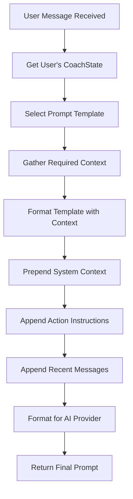
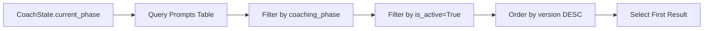
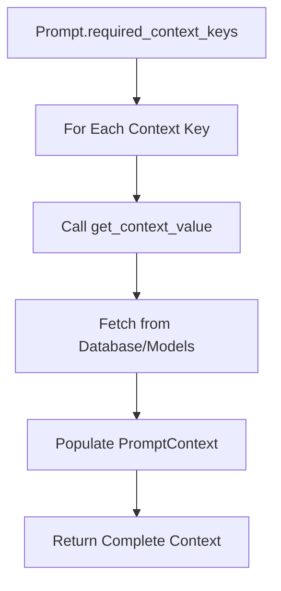
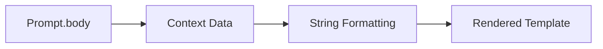
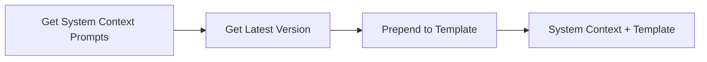
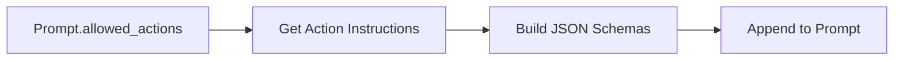
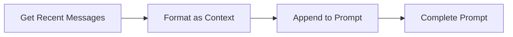
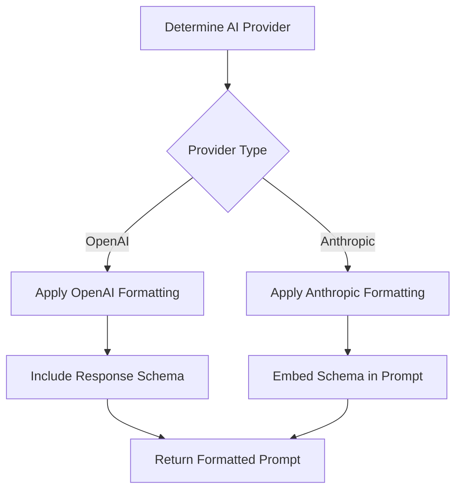

# Prompt Construction Process

The prompt construction process is the core workflow that transforms a user's message and coaching state into a fully formatted prompt for the AI service. This process involves multiple steps of data gathering, template selection, and formatting.

## High-Level Flow



## Detailed Step-by-Step Process

### Step 1: Retrieve User's CoachState

The process begins by retrieving the user's current coaching state from the database.

```python
coach_state = CoachState.objects.get(user=user)
state_value = coach_state.current_phase
```

**Purpose**: Determines which coaching phase the user is currently in, which drives prompt selection.

### Step 2: Select Prompt Template

The system queries the database to find the appropriate prompt template for the current coaching phase.



**Database Query Logic**:

- Filters by `coaching_phase` matching the user's current phase
- Only selects `is_active=True` prompts
- Orders by `version` descending to get the most recent version
- Optionally accepts a `version_override` parameter for testing

### Step 3: Gather Required Context

For each context key specified in the prompt's `required_context_keys`, the system fetches the corresponding data.



**Context Keys Available**:

- `user_name`: User's display name
- `identities`: All user identities formatted as text
- `number_of_identities`: Count of user's identities
- `identity_focus`: Currently focused identity
- `who_you_are`: User's self-description
- `who_you_want_to_be`: User's aspirational description
- `focused_identities`: List of focused identities
- `user_notes`: User's personal notes
- `current_message`: The user's current message
- `previous_message`: The previous message in conversation
- `current_phase`: Current coaching phase name
- `brainstorming_category_context`: Context for identity brainstorming
- `current_identity`: Currently selected identity
- `asked_questions`: Questions previously asked
- `refinement_identities`: Identities in refinement phase
- `affirmation_identities`: Identities with affirmations
- `visualization_identities`: Identities with visualizations

### Step 4: Format Template with Context

The prompt template is rendered with the gathered context data using Python's string formatting.



**Template Example**:

```markdown
You are helping {{user_name}} with {{current_phase}}.

Current Identities: {{identities}}

Focus: {{identity_focus}}
```

### Step 5: Prepend System Context

System context is retrieved from the database and prepended to the prompt.



**System Context**: Contains core coaching philosophy, communication guidelines, and process rules that apply to all interactions.

### Step 6: Append Action Instructions

Instructions for allowed actions are appended to the prompt with JSON schemas.



**Action Instructions**: Provide the AI with specific instructions on what actions it can perform and how to format the response.

### Step 7: Append Recent Messages

Recent chat messages are appended to provide conversation context.



**Recent Messages**: Typically includes the last 5 messages to provide conversation continuity.

### Step 8: Format for AI Provider

The final prompt is formatted according to the specific AI provider's requirements.



**Provider-Specific Formatting**:

- **OpenAI**: Response schema is passed separately
- **Anthropic**: Response schema is embedded in the prompt text

## Final Prompt Structure

The complete prompt follows this structure:

```
[System Context from Database]
[Formatted Template with Context]
[Action Instructions with JSON Schemas]
[Recent Chat Messages]
[Provider-Specific Formatting]
```

## Error Handling

The system includes several error handling mechanisms:

1. **No Prompt Found**: Raises `ValueError` if no active prompt exists for the current phase
2. **Missing Context**: Logs warnings for missing context data
3. **Invalid Actions**: Falls back to all actions if no allowed actions are specified
4. **Provider Errors**: Handles provider-specific formatting failures

## Performance Considerations

- **Database Queries**: Optimized to minimize database calls
- **Context Caching**: Context data is gathered efficiently
- **Template Rendering**: Uses efficient string formatting
- **Provider Detection**: Cached provider information

## Debugging and Logging

The system provides comprehensive logging at each step:

- Context gathering statistics
- Prompt construction details
- Provider formatting information
- Action instruction processing
