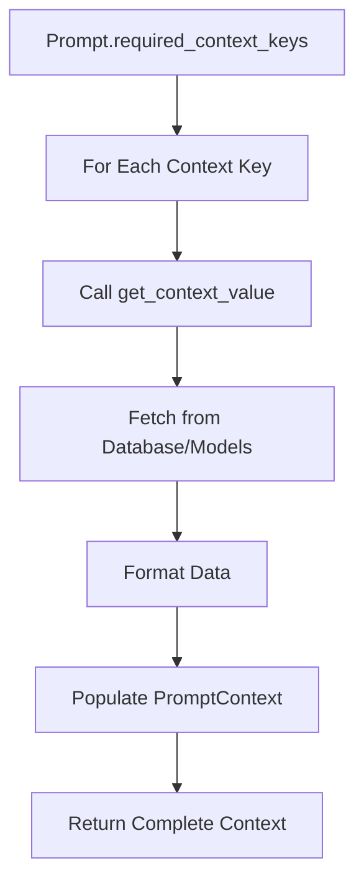
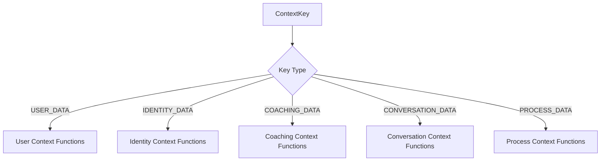

# Context Management

The Context Management system is responsible for gathering, organizing, and providing all the data needed to construct personalized prompts for each user interaction. This system ensures that every prompt contains the relevant user information, coaching state, and conversation context.

## Context Data Model

The system uses a Pydantic model called `PromptContext` to define and structure all available context data.

### PromptContext Structure

```python
class PromptContext(BaseModel):
    user_name: Optional[str]
    recent_messages: Optional[str]
    identities: Optional[str]
    number_of_identities: Optional[int]
    identity_focus: Optional[str]
    who_you_are: Optional[str]
    who_you_want_to_be: Optional[str]
    focused_identities: Optional[str]
    user_notes: Optional[str]
    current_message: Optional[str]
    previous_message: Optional[str]
    current_phase: Optional[str]
    brainstorming_category_context: Optional[str]
    current_identity: Optional[str]
    asked_questions: Optional[str]
    refinement_identities: Optional[str]
    affirmation_identities: Optional[str]
    visualization_identities: Optional[str]
```

## Context Gathering Process

The context gathering process follows a systematic approach to collect all required data for prompt construction.

### Gathering Flow



### Context Key Processing

```python
def gather_prompt_context(prompt: Prompt, coach_state: CoachState) -> PromptContext:
    context_data = {}
    for key in prompt.required_context_keys:
        context_data[key] = get_context_value(key, coach_state)

    prompt_context_fields = {field: None for field in PromptContext.model_fields.keys()}
    for key, value in context_data.items():
        field_name = key.value if hasattr(key, "value") else str(key)
        if field_name in prompt_context_fields:
            prompt_context_fields[field_name] = value
    return PromptContext(**prompt_context_fields)
```

## Available Context Keys

The system supports 18 different context keys, each providing specific data points for prompt personalization.

### User Information Context

| Context Key  | Description           | Data Source     |
| ------------ | --------------------- | --------------- |
| `user_name`  | User's display name   | User model      |
| `user_notes` | User's personal notes | UserNotes model |

### Identity Context

| Context Key                | Description                           | Data Source    |
| -------------------------- | ------------------------------------- | -------------- |
| `identities`               | All user identities formatted as text | Identity model |
| `number_of_identities`     | Count of user's identities            | Identity model |
| `identity_focus`           | Currently focused identity            | CoachState     |
| `current_identity`         | Currently selected identity           | CoachState     |
| `focused_identities`       | List of focused identities            | Identity model |
| `refinement_identities`    | Identities in refinement phase        | Identity model |
| `affirmation_identities`   | Identities with affirmations          | Identity model |
| `visualization_identities` | Identities with visualizations        | Identity model |

### Coaching State Context

| Context Key          | Description                     | Data Source |
| -------------------- | ------------------------------- | ----------- |
| `current_phase`      | Current coaching phase name     | CoachState  |
| `who_you_are`        | User's self-description         | CoachState  |
| `who_you_want_to_be` | User's aspirational description | CoachState  |
| `asked_questions`    | Questions previously asked      | CoachState  |

### Conversation Context

| Context Key        | Description                          | Data Source       |
| ------------------ | ------------------------------------ | ----------------- |
| `current_message`  | The user's current message           | ChatMessage model |
| `previous_message` | The previous message in conversation | ChatMessage model |
| `recent_messages`  | Recent chat messages                 | ChatMessage model |

### Process Context

| Context Key                      | Description                        | Data Source |
| -------------------------------- | ---------------------------------- | ----------- |
| `brainstorming_category_context` | Context for identity brainstorming | CoachState  |

## Context Value Retrieval

Each context key has a dedicated function that retrieves and formats the appropriate data.

### Context Value Functions



### Function Implementation Pattern

Each context function follows a consistent pattern:

```python
def get_context_value(key: ContextKey, coach_state: CoachState):
    if key == ContextKey.USER_NAME:
        return get_user_name_context(coach_state)
    elif key == ContextKey.IDENTITIES:
        return get_identities_context(coach_state)
    # ... additional context key handlers
```

## Data Formatting

Context data is formatted to be easily usable in prompt templates.

### Identity Formatting

Identities are formatted as readable text for inclusion in prompts:

```python
def get_identities_context(coach_state: CoachState) -> str:
    identities = Identity.objects.filter(user=coach_state.user)
    if not identities.exists():
        return "No identities created yet."

    formatted_identities = []
    for identity in identities:
        formatted_identities.append(f"- {identity.name}: {identity.description}")

    return "\n".join(formatted_identities)
```

### Message Formatting

Recent messages are formatted to provide conversation context:

```python
def get_recent_messages_context(coach_state: CoachState) -> str:
    recent_messages = ChatMessage.objects.filter(
        user=coach_state.user
    ).order_by("-timestamp")[:5]

    formatted_messages = []
    for message in reversed(recent_messages):
        role = "User" if message.role == MessageRole.USER else "Coach"
        formatted_messages.append(f"{role}: {message.content}")

    return "\n".join(formatted_messages)
```

## Context Key Categories

Context keys are organized into logical categories based on their purpose and data source.

### User Profile Context

Context keys that provide information about the user's profile and preferences:

- `user_name`: Basic user identification
- `user_notes`: Personal notes and preferences
- `who_you_are`: User's self-perception
- `who_you_want_to_be`: User's aspirations

### Identity Management Context

Context keys related to the user's identities and identity management:

- `identities`: Complete list of user identities
- `number_of_identities`: Count of identities
- `identity_focus`: Currently focused identity
- `current_identity`: Currently selected identity
- `focused_identities`: Identities marked as focused
- `refinement_identities`: Identities in refinement phase
- `affirmation_identities`: Identities with affirmations
- `visualization_identities`: Identities with visualizations

### Conversation Context

Context keys that provide conversation history and current message context:

- `current_message`: The user's current message
- `previous_message`: The previous message
- `recent_messages`: Recent conversation history

### Process Context

Context keys that provide information about the coaching process:

- `current_phase`: Current coaching phase
- `asked_questions`: Previously asked questions
- `brainstorming_category_context`: Context for brainstorming sessions

## Context Optimization

The system optimizes context gathering for performance and relevance.

### Selective Context Gathering

Only the context keys specified in `prompt.required_context_keys` are gathered:

```python
for key in prompt.required_context_keys:
    context_data[key] = get_context_value(key, coach_state)
```

### Efficient Database Queries

Context functions are optimized to minimize database queries:

- **Batch Queries**: Multiple related records are fetched in single queries
- **Selective Fields**: Only required fields are retrieved
- **Caching**: Frequently accessed data can be cached
- **Lazy Loading**: Data is only loaded when needed

### Context Validation

The system validates context data to ensure quality:

```python
# Validate context key existence
if key not in ContextKey.choices:
    log.warning(f"Unknown context key: {key}")

# Validate data format
if value is not None and not isinstance(value, str):
    value = str(value)
```

## Context Logging

The system provides comprehensive logging for context gathering activities.

### Context Statistics

```python
def log_context_stats(prompt_context: PromptContext):
    log.info("Context gathering statistics:")
    for field, value in prompt_context.model_dump().items():
        if value is not None:
            log.info(f"  {field}: {len(str(value))} characters")
        else:
            log.info(f"  {field}: None")
```

### Debug Information

Context gathering includes debug logging for troubleshooting:

- Context key processing
- Data retrieval success/failure
- Formatting operations
- Validation results

## Error Handling

The context management system includes robust error handling.

### Missing Data Handling

When context data is not available:

```python
def get_user_name_context(coach_state: CoachState) -> str:
    try:
        return coach_state.user.get_full_name() or coach_state.user.username
    except AttributeError:
        return "Unknown User"
```

### Database Error Handling

Database queries include error handling:

```python
def get_identities_context(coach_state: CoachState) -> str:
    try:
        identities = Identity.objects.filter(user=coach_state.user)
        # ... formatting logic
    except Exception as e:
        log.error(f"Error retrieving identities: {e}")
        return "Error retrieving identities"
```

### Context Key Validation

Invalid context keys are handled gracefully:

```python
def get_context_value(key: ContextKey, coach_state: CoachState):
    try:
        # ... context key processing
    except ValueError as e:
        log.warning(f"Invalid context key: {key} - {e}")
        return None
```
