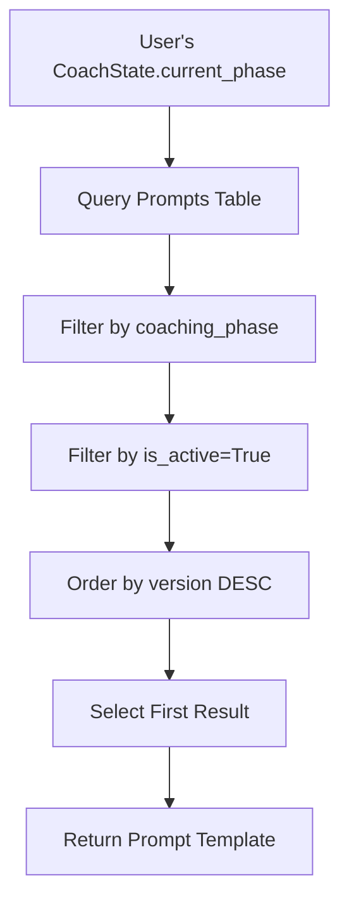
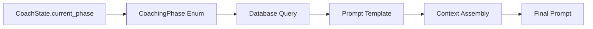
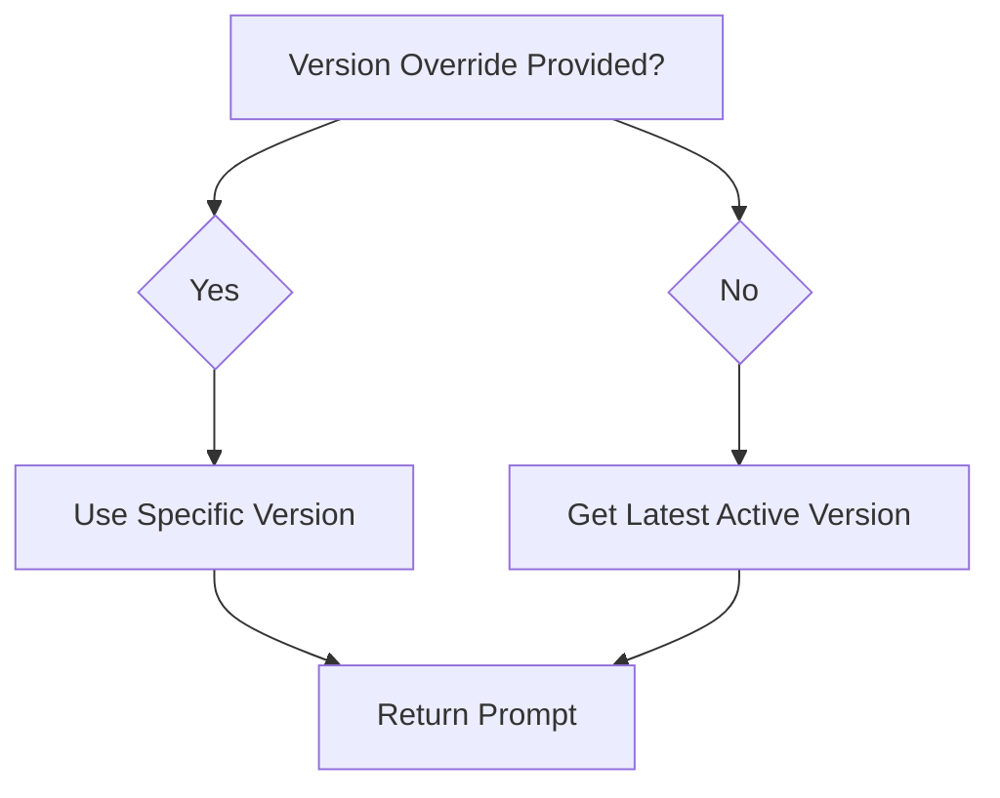
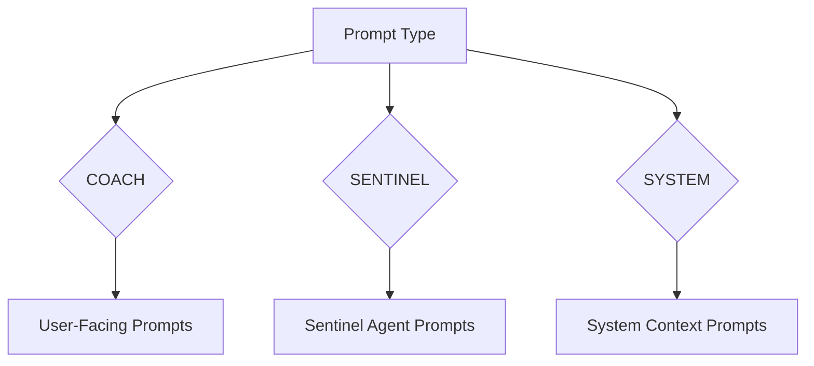

# Database Integration

The Prompt Manager integrates with the database to store, retrieve, and manage prompt templates. This integration enables dynamic prompt selection, version control, and context-driven prompt construction.

## Prompts Table Structure

The core of the database integration is the `Prompt` model, which stores all prompt templates with their associated metadata.

### Key Fields

| Field | Type | Description |
|-------|------|-------------|
| `id` | UUIDField | Primary key, auto-generated UUID |
| `coaching_phase` | CharField | Associated coaching phase (32 chars max) |
| `version` | IntegerField | Version number, defaults to 1 |
| `name` | CharField | Prompt name (255 chars max, optional) |
| `description` | TextField | Prompt description (optional) |
| `body` | TextField | The actual prompt template content |
| `required_context_keys` | ArrayField | List of required context keys |
| `allowed_actions` | ArrayField | List of allowed action types |
| `prompt_type` | CharField | Type of prompt (32 chars max, defaults to COACH) |
| `is_active` | BooleanField | Whether prompt is active, defaults to True |
| `created_at` | DateTimeField | Creation timestamp, auto-set |
| `updated_at` | DateTimeField | Last update timestamp, auto-updated |

### Unique Constraints

```sql
UNIQUE(coaching_phase, version)
```

This ensures that each coaching phase can have multiple versions, but no duplicate versions within the same phase.

## Prompt Selection Logic

The system uses a sophisticated query strategy to select the appropriate prompt for each user interaction.

### Query Process



### Database Query

```python
prompt_queryset = Prompt.objects.filter(
    coaching_phase=state_value,
    is_active=True,
)
if version_override is not None:
    prompt_queryset = prompt_queryset.filter(version=version_override)
prompt = prompt_queryset.order_by("-version").first()
```

**Query Logic**:
1. **Phase Matching**: Filters by the user's current coaching phase
2. **Active Prompts**: Only selects prompts marked as `is_active=True`
3. **Version Override**: Optionally accepts a specific version for testing
4. **Latest Version**: Orders by version descending and selects the first result

## Coaching Phase Integration

The system integrates with the `CoachingPhase` enum to ensure prompt selection aligns with the user's current coaching state.

### Available Coaching Phases

- `SYSTEM_CONTEXT`: System-level context (not a user phase)
- `INTRODUCTION`: Initial introduction phase
- `GET_TO_KNOW_YOU`: Getting to know the user
- `IDENTITY_WARMUP`: Identity warm-up exercises
- `IDENTITY_BRAINSTORMING`: Identity brainstorming phase
- `IDENTITY_REFINEMENT`: Identity refinement phase
- `IDENTITY_AFFIRMATION`: Identity affirmation phase
- `IDENTITY_VISUALIZATION`: Identity visualization phase

### Phase-Based Prompt Selection



## Version Management

The database supports comprehensive version control for prompt templates.

### Version Control Features

1. **Automatic Versioning**: Each new prompt gets an incremented version number
2. **Active/Inactive Toggle**: Prompts can be deactivated without deletion
3. **Rollback Capability**: Previous versions remain available
4. **Testing Support**: Version override allows testing specific versions

### Version Selection Strategy



## Context Keys Integration

The database stores which context keys are required for each prompt template.

### Context Key Storage

```python
required_context_keys = ArrayField(
    models.CharField(max_length=64, choices=ContextKey.choices),
    default=list,
    blank=True,
    help_text="List of required context keys for this prompt."
)
```

### Available Context Keys

The system supports 18 different context keys, each representing specific data points:

- User Information: `user_name`, `user_notes`
- Identity Data: `identities`, `number_of_identities`, `identity_focus`, `current_identity`
- Coaching State: `current_phase`, `who_you_are`, `who_you_want_to_be`
- Conversation: `current_message`, `previous_message`, `recent_messages`
- Identity Categories: `focused_identities`, `refinement_identities`, `affirmation_identities`, `visualization_identities`
- Process Data: `brainstorming_category_context`, `asked_questions`

## Action System Integration

The database controls which actions are allowed for each prompt through the `allowed_actions` field.

### Action Storage

```python
allowed_actions = ArrayField(
    models.CharField(max_length=64, choices=ActionType.choices),
    default=list,
    blank=True,
    help_text="List of allowed action types for this prompt."
)
```

### Available Action Types

The system supports 22 different action types, including:

- Identity Management: `create_identity`, `update_identity`, `accept_identity`
- Phase Control: `transition_phase`
- User Data: `update_who_you_are`, `update_who_you_want_to_be`
- Notes: `add_user_note`, `update_user_note`, `delete_user_note`
- Identity Focus: `select_identity_focus`
- Category Control: `skip_identity_category`, `unskip_identity_category`

## Prompt Type Classification

The database supports different types of prompts through the `prompt_type` field.

### Prompt Types

- `COACH`: Standard coaching prompts (default)
- `SENTINEL`: Sentinel agent prompts
- `SYSTEM`: System-level prompts

### Type-Based Organization



## Error Handling

The database integration includes robust error handling for various scenarios.

### Common Error Scenarios

1. **No Active Prompt**: When no active prompt exists for a coaching phase
2. **Invalid Version**: When a requested version doesn't exist
3. **Missing Context Keys**: When required context keys are not available
4. **Invalid Actions**: When specified actions are not recognized

### Error Responses

```python
if not prompt:
    raise ValueError(f"No prompt found for state {state_value}")
```

## Performance Optimization

The database integration is optimized for performance through several strategies.

### Query Optimization

1. **Indexed Fields**: `coaching_phase`, `is_active`, `version` are indexed
2. **Efficient Filtering**: Uses database-level filtering rather than application-level
3. **Single Query**: Retrieves all necessary data in one query
4. **Caching**: Prompt templates can be cached for frequently accessed phases

### Database Indexes

```sql
CREATE INDEX idx_prompts_coaching_phase ON prompts(coaching_phase);
CREATE INDEX idx_prompts_active ON prompts(is_active);
CREATE INDEX idx_prompts_version ON prompts(version);
CREATE INDEX idx_prompts_phase_active_version ON prompts(coaching_phase, is_active, version);
```

## Data Integrity

The database integration ensures data integrity through several mechanisms.

### Constraints

1. **Unique Constraints**: Prevents duplicate versions within phases
2. **Foreign Key Relationships**: Ensures referential integrity
3. **Validation**: Context keys and action types are validated against enums
4. **Timestamps**: Automatic tracking of creation and modification times

### Data Validation

```python
# Context keys validation
required_context_keys = ArrayField(
    models.CharField(max_length=64, choices=ContextKey.choices),
    # ...
)

# Action types validation
allowed_actions = ArrayField(
    models.CharField(max_length=64, choices=ActionType.choices),
    # ...
)
```
