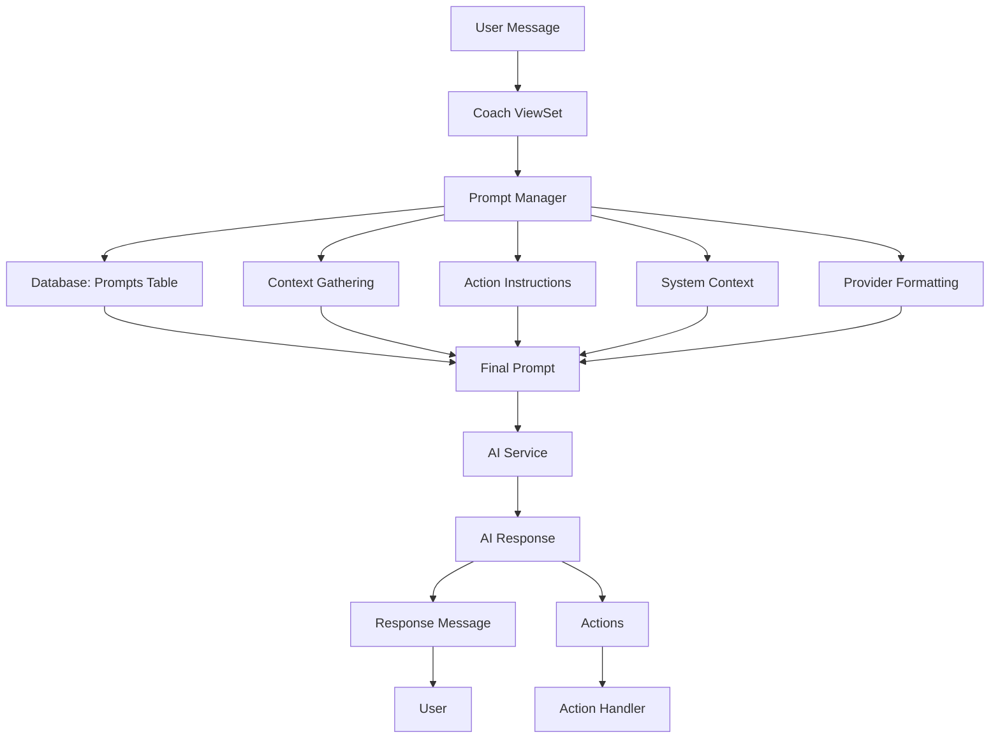

# Prompt Manager Overview

The Prompt Manager is the core system responsible for constructing, formatting, and managing AI prompts used during coaching sessions. It serves as the bridge between the user's current coaching state and the AI service, ensuring that each prompt contains the appropriate context, instructions, and formatting for optimal AI responses.

## Purpose

The Prompt Manager handles three critical functions:

1. **Dynamic Prompt Selection**: Retrieves the appropriate prompt template based on the user's current coaching phase
2. **Context Assembly**: Gathers all relevant user data, chat history, and coaching state information
3. **Prompt Construction**: Formats the final prompt with proper context, instructions, and provider-specific formatting

## System Architecture

## Key Components

### 1. PromptManager Class

The main orchestrator that coordinates all prompt construction activities. Located in `server/services/prompt_manager/manager.py`.

### 2. Database Integration

- **Prompts Table**: Stores prompt templates with versioning
- **CoachState**: Provides current coaching phase and user progress
- **Context Keys**: Defines what data should be included in prompts

### 3. Context Management

- **PromptContext Model**: Pydantic model defining all available context fields
- **Context Gathering**: Utilities that fetch specific data from the database
- **Context Keys**: Enumeration of all available context data points

### 4. Action System Integration

- **Allowed Actions**: Controls what actions the AI can perform
- **Action Instructions**: Provides JSON schemas for action execution
- **Dynamic Response Format**: Builds provider-specific response schemas

### 5. Provider Formatting

- **AI Provider Detection**: Determines the target AI service (OpenAI, Anthropic)
- **Provider-Specific Formatting**: Applies appropriate formatting rules
- **Response Schema Integration**: Includes response format requirements

## Core Flow

1. **User sends message** to the coach endpoint
2. **Coach ViewSet** receives the message and calls PromptManager
3. **PromptManager** retrieves the user's CoachState
4. **Database query** selects the appropriate prompt based on current phase
5. **Context gathering** collects all required user data and chat history
6. **Prompt construction** assembles the final prompt with all components
7. **Provider formatting** applies AI-specific formatting rules
8. **Final prompt** is returned to the calling service
9. **AI service** receives the final prompt and generates response (handled by AI Service)
10. **Action handler** processes any actions returned by the AI (handled by Action Handler Service)

## Version Management

The system supports prompt versioning to enable:

- **Iterative improvement** of prompts
- **A/B testing** of different prompt versions
- **Rollback capability** to previous versions
- **Development workflow** for testing new prompts

## Integration Points

### With Coach State

- Reads current coaching phase
- Accesses user progress and preferences
- Retrieves chat history and context

### With Action Handler

- Provides allowed actions list and response schemas
- Action execution is handled by the Action Handler service (documented separately)

### With AI Services

- Sends constructed prompts
- Receives AI responses
- AI service integration is handled by the AI Service (documented separately)

### With Database

- Queries prompt templates
- Retrieves user data and context
- Manages prompt versioning

## Benefits

- **Centralized prompt management** for consistent coaching experience
- **Dynamic context assembly** ensures relevant information is always included
- **Provider flexibility** supports multiple AI services
- **Version control** enables prompt iteration and improvement
- **Action control** ensures AI responses are properly structured
- **Modular design** allows for easy extension and maintenance
