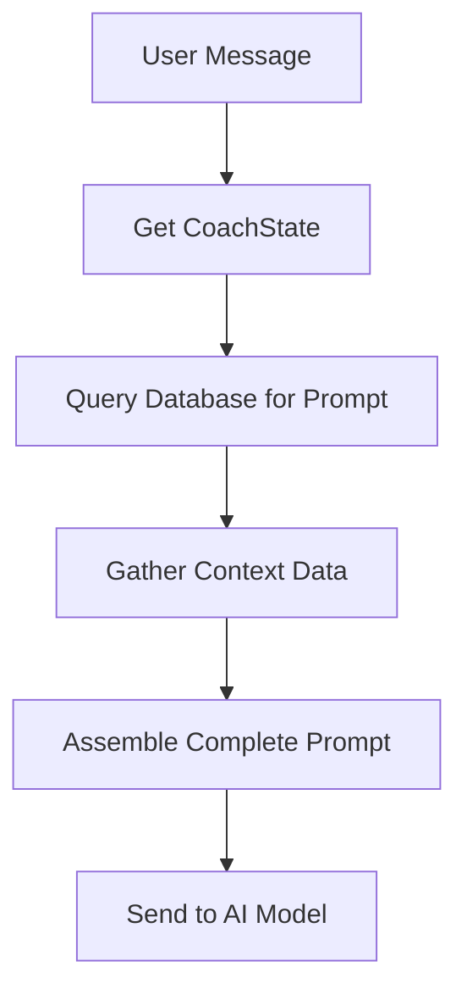

# Overview

The Prompt Manager is responsible for two main tasks:

1. **Pull the right prompt** from the database based on the user's current coaching phase
2. **Assemble the complete prompt** to pass to the AI model

## How It Works

### 1. Prompt Selection

The Prompt Manager queries the database to find the most recent active prompt for the user's current coaching phase:

```python
coach_state = CoachState.objects.get(user=user)
prompt = Prompt.objects.filter(
    coaching_phase=coach_state.current_phase,
    is_active=True
).order_by("-version").first()
```

### 2. Prompt Assembly

The Prompt Manager assembles the complete prompt by combining:

- **System Context**: Core coaching guidelines (prepended)
- **User Notes**: Extracted user information from the [Sentinel Memory System](../sentinel/overview)
- **Template Content**: The selected prompt template with context data
- **Action Instructions**: What actions the AI can perform
- **Recent Messages**: Conversation history

## Process Flow



## Prompt Templates

### Template Structure

Templates are stored in the database and use Python string formatting with placeholders:

```markdown
You are helping {{user_name}} with {{current_phase}}.

Current Identities: {{identities}}

Focus: {{identity_focus}}
```

### Context Placeholders

Templates use placeholders that get replaced with actual data:

| Placeholder          | Description                |
| -------------------- | -------------------------- |
| `{{user_name}}`      | User's display name        |
| `{{identities}}`     | All user identities        |
| `{{current_phase}}`  | Current coaching phase     |
| `{{identity_focus}}` | Currently focused identity |

For a complete list of available context keys, see the [Context Keys documentation](context-keys/overview).

### Template Rendering

Templates are rendered using Python's string formatting:

```python
if callable(getattr(prompt_body, "format", None)):
    prompt_body = prompt_body.format(**prompt_context.model_dump())
```

## System Context

The System Context provides core coaching guidelines that are prepended to every prompt:

```python
system_context = Prompt.objects.filter(
    coaching_phase=CoachingPhase.SYSTEM_CONTEXT,
    is_active=True
).order_by("-version").first()

if system_context:
    return f"{system_context.body}\n{system_message}"
```

**Key Characteristics:**

- **No Context Keys**: Uses no dynamic content or placeholders
- **Static Text**: Contains only static coaching guidelines
- **Global Application**: Applied to all coaching interactions

## Provider Formatting

The system applies provider-specific formatting before sending to AI models:

```python
def format_for_provider(prompt, prompt_context, provider, response_format):
    prompt_body = prompt.body

    # Format template with context
    if callable(getattr(prompt_body, "format", None)):
        prompt_body = prompt_body.format(**prompt_context.model_dump())

    # Provider-specific formatting
    if provider == AIProvider.OPENAI:
        pass  # No additional formatting needed
    elif provider == AIProvider.ANTHROPIC:
        response_format_schema = response_format.model_json_schema()
        prompt_body += f"\n\nYour response must be in the form of a JSON object.\n{response_format_schema}"

    return prompt_body, response_format
```

## Database Integration

### Prompt Model

The `Prompt` model contains:

**Core Fields:**

- `coaching_phase`: Which coaching phase this prompt is for
- `version`: Version number (auto-incremented)
- `body`: The actual prompt template with placeholders
- `is_active`: Whether this version is active

**Configuration Fields:**

- `required_context_keys`: List of context keys needed for this prompt
- `allowed_actions`: List of actions the AI can perform
- `prompt_type`: Type of prompt (coach, sentinel, system)

### Version Management

- **Automatic Versioning**: New prompts get the next version number
- **Active Version**: Only one version per coaching phase can be active
- **Unique Constraint**: `(coaching_phase, version)` must be unique

## Complete Assembly Process

1. **Get User's CoachState**

   ```python
   coach_state = CoachState.objects.get(user=user)
   ```

2. **Find the Right Prompt**

   ```python
   prompt = Prompt.objects.filter(
       coaching_phase=coach_state.current_phase,
       is_active=True
   ).order_by("-version").first()
   ```

3. **Gather Context Data**

   ```python
   prompt_context = gather_prompt_context(prompt, coach_state)
   ```

4. **Format Template**

   ```python
   if callable(getattr(prompt_body, "format", None)):
       prompt_body = prompt_body.format(**prompt_context.model_dump())
   ```

5. **Add User Notes**

   ```python
   coach_prompt = prepend_user_notes(coach_prompt, coach_state)
   ```

6. **Add System Context**

   ```python
   coach_prompt = prepend_system_context(coach_prompt)
   ```

7. **Add Action Instructions**

   ```python
   coach_prompt = append_action_instructions(coach_prompt, prompt.allowed_actions)
   ```

8. **Add Recent Messages**

   ```python
   coach_prompt = append_recent_messages(coach_prompt, coach_state)
   ```

9. **Format for AI Provider**
   ```python
   coach_prompt, response_format = format_for_provider(
       prompt, prompt_context, provider, response_format_model
   )
   ```

## Final Prompt Structure

```
[System Context]
[User Notes]
[Formatted Template with Context Data]
[Action Instructions]
[Recent Messages]
```

## Error Handling

- **No prompt found**: Raises `ValueError`
- **Missing context**: Logs warnings, continues with available data
- **No allowed actions**: Uses all available actions as fallback
- **No system context**: Continues without system context

## Integration

- **Input**: User message and CoachState
- **Output**: Complete formatted prompt for AI model
- **Dependencies**: Database (prompts table), Context Keys, Action Handler

For detailed information about specific components, see:

- [Context Keys](context-keys/overview) - Available context data
- [Action Handler](../action-handler/overview) - Action execution
- [Prompts API](../../api/endpoints/prompts) - Prompt management
