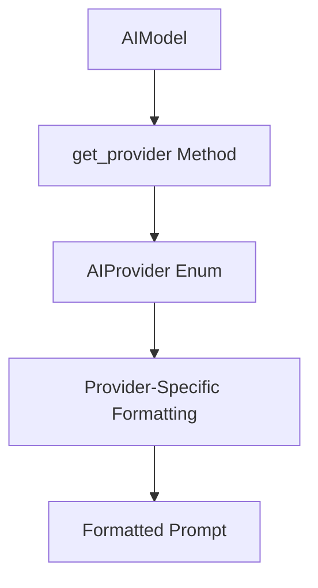
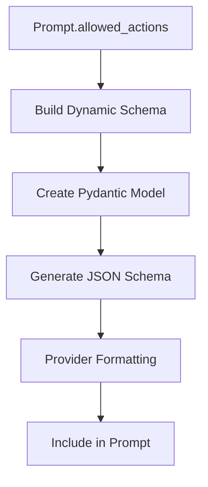

# Provider Formatting

The Provider Formatting system adapts prompts to work with different AI providers, ensuring optimal compatibility and performance across various AI services. This system handles provider-specific requirements for prompt structure, response schemas, and formatting conventions.

## Provider Support

The system currently supports two major AI providers:

- **OpenAI**: GPT models (GPT-4, GPT-3.5-turbo)
- **Anthropic**: Claude models (Claude-3, Claude-2)

Note: The actual AI service integration and API calls are handled by the AI Service (documented separately). The Prompt Manager is responsible for formatting prompts appropriately for each provider.

## Provider Detection

The system automatically detects the target AI provider based on the selected model.

### Provider Detection Flow



### Provider Detection Code

```python
provider = AIModel.get_provider(model)
log.debug(f"provider: {provider}")
```

## Provider-Specific Formatting

Each AI provider has unique requirements for prompt formatting and response schemas.

### OpenAI Formatting

OpenAI models use a system/user/assistant message structure with separate response schema handling.

#### OpenAI Prompt Structure

```
System Message:
[System Context]
[Formatted Template with Context]
[Action Instructions]

User Message:
[Recent Messages]

Assistant Message:
[AI Response with Actions]
```

#### OpenAI Response Schema Handling

For OpenAI, the response schema is passed separately to the API call:

```python
if provider == AIProvider.OPENAI:
    # Response schema passed separately to OpenAI API
    # No additional formatting needed in prompt
    pass
```

#### OpenAI Formatting Process


### Anthropic Formatting

Anthropic models use a single message structure with embedded response schemas.

#### Anthropic Prompt Structure

```
[System Context]
[Formatted Template with Context]
[Action Instructions]
[Recent Messages]
[Response Schema Embedded in Prompt]

Your response must be in the form of a JSON object.
{response_format_schema}
```

#### Anthropic Response Schema Handling

For Anthropic, the response schema is embedded directly in the prompt text:

```python
elif provider == AIProvider.ANTHROPIC:
    response_format_schema = response_format.model_json_schema()
    prompt_body += f"\n\nYour response must be in the form of a JSON object.\n{response_format_schema}"
```

#### Anthropic Formatting Process


## Formatting Implementation

The provider formatting is implemented in the `format_for_provider` function.

### Formatting Function

```python
def format_for_provider(
    prompt: Prompt,
    prompt_context: PromptContext,
    provider: AIProvider,
    response_format: BaseModel,
):
    """Internal helper to apply provider-specific formatting to the prompt body."""
    log_context_stats(prompt_context)
    prompt_body = prompt.body
    
    # Format template with context
    if callable(getattr(prompt_body, "format", None)):
        prompt_body = prompt_body.format(**prompt_context.model_dump())
    
    # Provider-specific formatting
    if provider == AIProvider.OPENAI:
        pass  # No additional formatting needed for OpenAI
    elif provider == AIProvider.ANTHROPIC:
        response_format_schema = response_format.model_json_schema()
        prompt_body += f"\n\nYour response must be in the form of a JSON object.\n{response_format_schema}"

    return prompt_body, response_format
```

## Response Schema Generation

The system dynamically generates response schemas based on allowed actions.

### Schema Generation Process



### Dynamic Schema Building

```python
response_format_model = build_dynamic_response_format(prompt.allowed_actions)
log.debug(f"response_format_model: {response_format_model}")
```

## Provider-Specific Features

Each provider has unique features and requirements that the system accommodates.

### OpenAI Features

- **Message Structure**: System/user/assistant message format
- **Response Schema**: Passed separately in API call
- **Token Limits**: Handles token limits efficiently
- **Function Calling**: Supports function calling for structured responses

### Anthropic Features

- **Single Message**: All content in one message
- **Embedded Schema**: Response schema included in prompt
- **Constitutional AI**: Leverages constitutional AI principles
- **Context Windows**: Handles large context windows

Note: The actual API integration and model-specific features are handled by the AI Service (documented separately).

## Formatting Optimization

The system optimizes formatting for each provider's strengths and limitations.

### Token Optimization

```python
def optimize_for_tokens(prompt_body: str, provider: AIProvider) -> str:
    if provider == AIProvider.OPENAI:
        # Optimize for OpenAI token limits
        return optimize_openai_tokens(prompt_body)
    elif provider == AIProvider.ANTHROPIC:
        # Optimize for Anthropic context windows
        return optimize_anthropic_context(prompt_body)
```

### Context Window Management

```python
def manage_context_window(prompt_body: str, provider: AIProvider) -> str:
    max_tokens = get_provider_max_tokens(provider)
    if len(prompt_body) > max_tokens:
        return truncate_prompt(prompt_body, max_tokens)
    return prompt_body
```

## Provider Compatibility

The system ensures compatibility across different provider versions and models.

### Model Compatibility Matrix

| Provider | Models | Features | Limitations |
|----------|--------|----------|-------------|
| OpenAI | GPT-4, GPT-3.5-turbo | Function calling, JSON mode | Token limits |
| Anthropic | Claude-3, Claude-2 | Large context, constitutional AI | Response format embedding |

### Version Handling

```python
def handle_provider_version(provider: AIProvider, model: AIModel) -> str:
    if provider == AIProvider.OPENAI:
        return handle_openai_version(model)
    elif provider == AIProvider.ANTHROPIC:
        return handle_anthropic_version(model)
```

## Error Handling

The provider formatting system includes comprehensive error handling.

### Provider Detection Errors

```python
def handle_provider_detection_error(model: AIModel) -> AIProvider:
    try:
        return AIModel.get_provider(model)
    except ValueError:
        log.warning(f"Unknown model {model}, defaulting to OpenAI")
        return AIProvider.OPENAI
```

### Formatting Errors

```python
def handle_formatting_error(prompt_body: str, provider: AIProvider) -> str:
    try:
        return format_for_provider(prompt_body, provider)
    except Exception as e:
        log.error(f"Formatting error for {provider}: {e}")
        return prompt_body  # Return unformatted as fallback
```

### Schema Generation Errors

```python
def handle_schema_error(allowed_actions: List[ActionType]) -> BaseModel:
    try:
        return build_dynamic_response_format(allowed_actions)
    except Exception as e:
        log.error(f"Schema generation error: {e}")
        return get_default_response_format()
```

## Performance Considerations

The provider formatting system is optimized for performance.

### Caching

```python
def cache_provider_formatting(provider: AIProvider, prompt_hash: str) -> str:
    cache_key = f"{provider}_{prompt_hash}"
    if cache_key in formatting_cache:
        return formatting_cache[cache_key]
    
    formatted_prompt = format_for_provider(...)
    formatting_cache[cache_key] = formatted_prompt
    return formatted_prompt
```

### Lazy Loading

```python
def lazy_load_provider_features(provider: AIProvider):
    if provider == AIProvider.OPENAI:
        return load_openai_features()
    elif provider == AIProvider.ANTHROPIC:
        return load_anthropic_features()
```

## Testing and Validation

The system includes comprehensive testing for provider formatting.

### Provider-Specific Tests

```python
def test_openai_formatting():
    prompt = create_test_prompt()
    formatted = format_for_provider(prompt, context, AIProvider.OPENAI, schema)
    assert "system" in formatted
    assert "user" in formatted

def test_anthropic_formatting():
    prompt = create_test_prompt()
    formatted = format_for_provider(prompt, context, AIProvider.ANTHROPIC, schema)
    assert "JSON object" in formatted
    assert "response_format_schema" in formatted
```

### Cross-Provider Validation

```python
def validate_cross_provider_compatibility():
    prompt = create_test_prompt()
    openai_result = format_for_provider(prompt, context, AIProvider.OPENAI, schema)
    anthropic_result = format_for_provider(prompt, context, AIProvider.ANTHROPIC, schema)
    
    # Validate that both formats contain essential elements
    assert "system_context" in openai_result
    assert "system_context" in anthropic_result
```

## Future Provider Support

The system is designed to easily support additional AI providers.

### Provider Extension Pattern

```python
def add_provider_support(new_provider: AIProvider):
    # Add to AIProvider enum
    # Implement provider-specific formatting
    # Add provider detection logic
    # Update tests and validation
```

### Provider Configuration

```python
class ProviderConfig:
    def __init__(self, provider: AIProvider):
        self.provider = provider
        self.max_tokens = self.get_max_tokens()
        self.supports_functions = self.get_function_support()
        self.response_format_style = self.get_response_format_style()
```

## Monitoring and Logging

The provider formatting system includes comprehensive monitoring.

### Formatting Metrics

```python
def log_formatting_metrics(provider: AIProvider, prompt_length: int, format_time: float):
    log.info(f"Provider: {provider}, Length: {prompt_length}, Time: {format_time}")
    metrics.record_formatting_time(provider, format_time)
    metrics.record_prompt_length(provider, prompt_length)
```

### Error Tracking

```python
def track_formatting_errors(provider: AIProvider, error: Exception):
    log.error(f"Formatting error for {provider}: {error}")
    metrics.record_formatting_error(provider, error)
```
