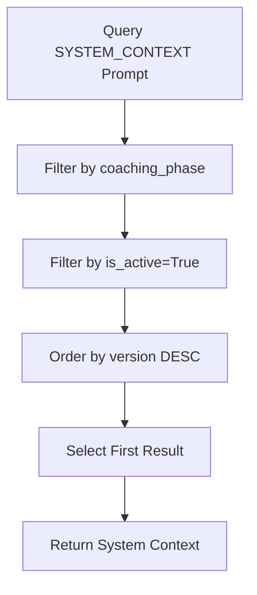
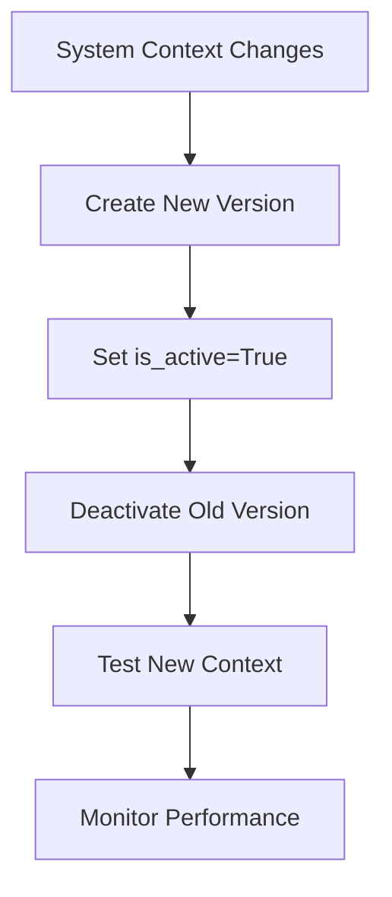
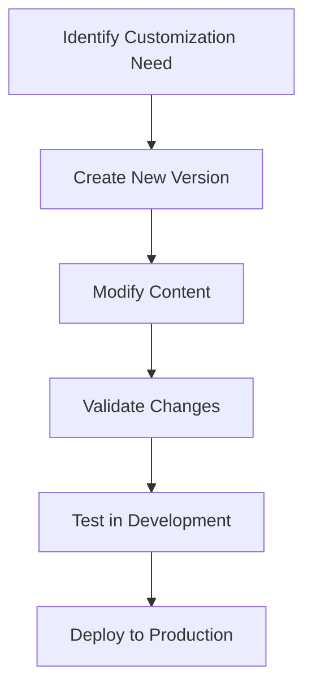
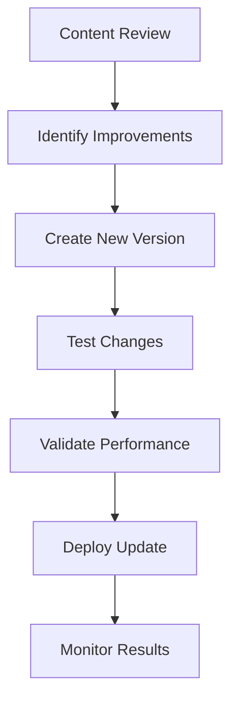

# System Context

The System Context is a foundational component that provides core coaching philosophy, communication guidelines, and process rules that apply to all AI interactions. This context is prepended to every prompt to ensure consistent coaching behavior and maintain the system's core principles.

## System Context Overview

The System Context serves as the foundation for all coaching interactions, providing:

1. **Core Philosophy**: The fundamental coaching approach and principles
2. **Communication Guidelines**: How the AI should communicate with users
3. **Process Rules**: Guidelines for coaching flow and transitions
4. **Behavioral Standards**: Expected AI behavior and response patterns

## System Context Storage

Unlike other prompt components, the System Context is stored in the database as a special prompt with the `SYSTEM_CONTEXT` coaching phase.

### Database Storage

```python
system_prompt_queryset = Prompt.objects.filter(
    coaching_phase=CoachingPhase.SYSTEM_CONTEXT,
    is_active=True,
)
system_context = system_prompt_queryset.order_by("-version").first()
```

### System Context Retrieval



## System Context Integration

The System Context is prepended to every prompt during the construction process.

### Integration Flow


### Integration Function

```python
def prepend_system_context(system_message: str) -> str:
    """Prepend the system context from the most recent version of the SYSTEM_CONTEXT to the given system message."""
    system_prompt_queryset = Prompt.objects.filter(
        coaching_phase=CoachingPhase.SYSTEM_CONTEXT,
        is_active=True,
    )
    system_context = system_prompt_queryset.order_by("-version").first()
    if system_context:
        return f"{system_context.body}\n{system_message}"
    else:
        log.warning(f"System context not found for state {CoachingPhase.SYSTEM_CONTEXT}")
        return system_message
```

## System Context Content

The System Context contains several key sections that guide AI behavior.

### Core Coaching Philosophy

The system context includes the fundamental coaching approach:

- **User-Centered Focus**: Emphasis on user growth and development
- **Identity-Based Coaching**: Framework for identity creation and management
- **Process-Oriented Approach**: Structured coaching phases and progression
- **Empowerment Principles**: Encouraging user agency and self-discovery

### Communication Guidelines

Guidelines for how the AI should communicate:

- **Tone and Style**: Warm, supportive, and professional communication
- **Response Patterns**: How to structure responses and provide guidance
- **Question Techniques**: Effective questioning strategies
- **Feedback Methods**: Constructive and encouraging feedback approaches

### Process Rules

Rules governing the coaching process:

- **Phase Transitions**: When and how to move between coaching phases
- **Identity Management**: Guidelines for identity creation and refinement
- **Goal Setting**: Approaches to setting and tracking goals
- **Progress Monitoring**: How to track and acknowledge user progress

### Behavioral Standards

Expected AI behavior patterns:

- **Consistency**: Maintaining consistent coaching approach
- **Adaptability**: Adjusting to user needs and preferences
- **Boundaries**: Professional boundaries and limitations
- **Ethics**: Ethical considerations and user privacy

## System Context Versioning

The System Context supports versioning to enable iterative improvement and testing.

### Version Management



### Version Control Benefits

1. **Iterative Improvement**: Gradually improve system context
2. **A/B Testing**: Test different system context versions
3. **Rollback Capability**: Revert to previous versions if needed
4. **Development Workflow**: Safe testing of new context

## System Context Structure

The System Context follows a structured format to ensure clarity and effectiveness.

### Content Organization

```
[Core Philosophy Section]
- Fundamental coaching principles
- Approach to user development
- Identity-based framework

[Communication Guidelines]
- Tone and style requirements
- Response structure patterns
- Question and feedback techniques

[Process Rules]
- Phase transition guidelines
- Identity management rules
- Goal setting approaches

[Behavioral Standards]
- Consistency requirements
- Adaptability guidelines
- Ethical considerations
```

### Content Validation

The system context content is validated to ensure quality:

```python
def validate_system_context(content: str) -> bool:
    required_sections = [
        "Core Philosophy",
        "Communication Guidelines", 
        "Process Rules",
        "Behavioral Standards"
    ]
    
    for section in required_sections:
        if section not in content:
            return False
    return True
```

## System Context Customization

The System Context can be customized for different use cases and requirements.

### Context Variants

Different system context versions can be created for:

- **Development Testing**: Simplified context for development
- **Production Use**: Full context for production environments
- **Specialized Coaching**: Context tailored for specific coaching approaches
- **Regional Variations**: Context adapted for different regions or cultures

### Customization Process



## System Context Performance

The System Context is optimized for performance and efficiency.

### Caching Strategy

```python
def cache_system_context():
    system_context = get_system_context()
    cache.set("system_context", system_context, timeout=3600)  # 1 hour cache
    return system_context

def get_cached_system_context():
    cached_context = cache.get("system_context")
    if cached_context:
        return cached_context
    return cache_system_context()
```

### Optimization Techniques

1. **Content Compression**: Minimize system context size
2. **Efficient Retrieval**: Optimize database queries
3. **Caching**: Cache system context to reduce database calls
4. **Lazy Loading**: Load context only when needed

## System Context Monitoring

The system includes monitoring and logging for system context usage.

### Usage Tracking

```python
def track_system_context_usage():
    log.info("System context retrieved and prepended to prompt")
    metrics.record_system_context_usage()
```

### Performance Monitoring

```python
def monitor_system_context_performance():
    start_time = time.time()
    system_context = get_system_context()
    end_time = time.time()
    
    log.info(f"System context retrieval time: {end_time - start_time}")
    metrics.record_retrieval_time(end_time - start_time)
```

## Error Handling

The system includes robust error handling for system context operations.

### Missing System Context

```python
def handle_missing_system_context():
    log.warning("System context not found, using fallback")
    return get_fallback_system_context()
```

### Invalid System Context

```python
def handle_invalid_system_context(content: str):
    log.error("Invalid system context detected")
    if not validate_system_context(content):
        return get_default_system_context()
    return content
```

### Database Errors

```python
def handle_system_context_db_error(error: Exception):
    log.error(f"Database error retrieving system context: {error}")
    return get_cached_system_context() or get_default_system_context()
```

## System Context Testing

The system includes comprehensive testing for system context functionality.

### Content Validation Tests

```python
def test_system_context_validation():
    valid_context = create_valid_system_context()
    assert validate_system_context(valid_context) == True
    
    invalid_context = create_invalid_system_context()
    assert validate_system_context(invalid_context) == False
```

### Integration Tests

```python
def test_system_context_integration():
    prompt_template = "Test prompt template"
    system_context = get_system_context()
    
    result = prepend_system_context(prompt_template)
    assert system_context in result
    assert prompt_template in result
```

### Performance Tests

```python
def test_system_context_performance():
    start_time = time.time()
    for _ in range(100):
        get_system_context()
    end_time = time.time()
    
    avg_time = (end_time - start_time) / 100
    assert avg_time < 0.01  # Should be under 10ms average
```

## System Context Maintenance

Regular maintenance ensures the system context remains effective and up-to-date.

### Content Review

Regular reviews of system context content:

- **Effectiveness Assessment**: Evaluate coaching outcomes
- **User Feedback Analysis**: Incorporate user feedback
- **Performance Metrics**: Review AI response quality
- **Process Optimization**: Improve coaching flow

### Update Process



### Maintenance Schedule

- **Weekly**: Performance monitoring and basic validation
- **Monthly**: Content effectiveness review
- **Quarterly**: Comprehensive content update and optimization
- **Annually**: Major system context revision and improvement
