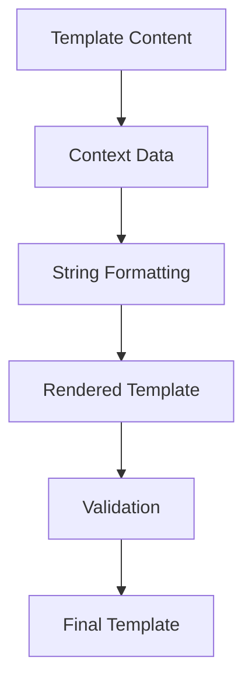
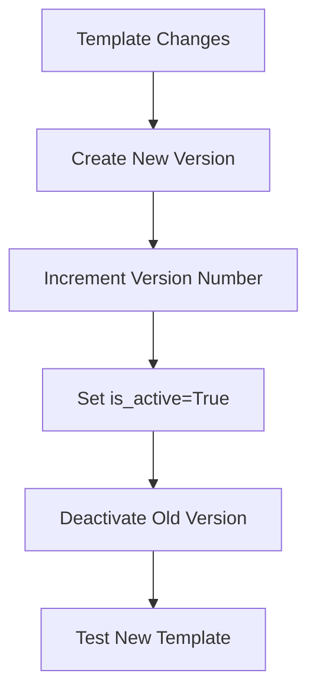
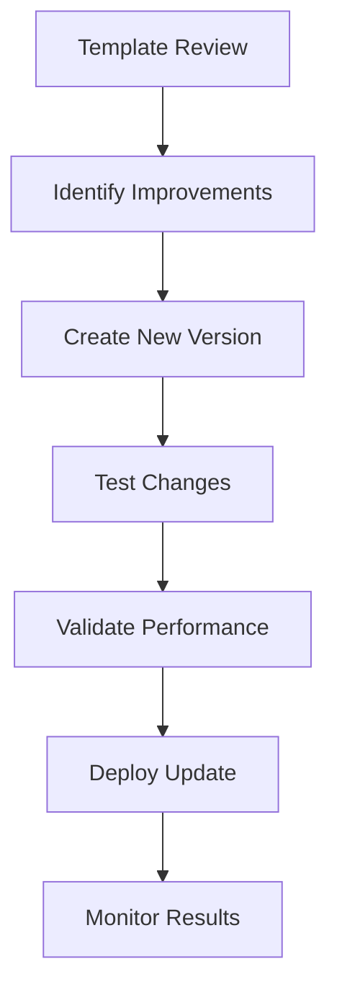

# Prompt Templates

Prompt Templates are the foundation of the Prompt Manager system, providing structured, reusable prompts that can be dynamically populated with user-specific context. These templates use placeholders to insert personalized data while maintaining consistent coaching structure and quality.

## Template Overview

Prompt Templates are stored in the database and contain:

- **Template Content**: The base prompt text with placeholders
- **Context Requirements**: Which context keys are needed
- **Action Permissions**: What actions the AI can perform
- **Version Control**: Multiple versions for iteration and testing

## Template Structure

### Basic Template Format

```markdown
You are helping {{user_name}} with {{current_phase}}.

Current Identities:
{{identities}}

Focus: {{identity_focus}}

Your task is to guide {{user_name}} through {{current_phase}} effectively.
```

### Template Components

1. **Static Content**: Fixed text that doesn't change
2. **Context Placeholders**: Dynamic data insertion points
3. **Instructions**: Specific guidance for the AI
4. **Constraints**: Limitations and requirements

## Context Placeholders

Templates use Python string formatting syntax with double curly braces for context placeholders.

### Placeholder Syntax

```python
# Basic placeholder
{{user_name}}

# With default value (if supported)
{{user_name|default="User"}}

# Nested context (if available)
{{identities.0.name}}
```

### Available Placeholders

| Placeholder | Context Key | Description |
|-------------|-------------|-------------|
| `{{user_name}}` | `user_name` | User's display name |
| `{{identities}}` | `identities` | All user identities |
| `{{number_of_identities}}` | `number_of_identities` | Count of identities |
| `{{identity_focus}}` | `identity_focus` | Currently focused identity |
| `{{who_you_are}}` | `who_you_are` | User's self-description |
| `{{who_you_want_to_be}}` | `who_you_want_to_be` | User's aspirations |
| `{{focused_identities}}` | `focused_identities` | List of focused identities |
| `{{user_notes}}` | `user_notes` | User's personal notes |
| `{{current_message}}` | `current_message` | Current user message |
| `{{previous_message}}` | `previous_message` | Previous message |
| `{{current_phase}}` | `current_phase` | Current coaching phase |
| `{{brainstorming_category_context}}` | `brainstorming_category_context` | Brainstorming context |
| `{{current_identity}}` | `current_identity` | Currently selected identity |
| `{{asked_questions}}` | `asked_questions` | Previously asked questions |
| `{{refinement_identities}}` | `refinement_identities` | Identities in refinement |
| `{{affirmation_identities}}` | `affirmation_identities` | Identities with affirmations |
| `{{visualization_identities}}` | `visualization_identities` | Identities with visualizations |

## Template Rendering Process

The template rendering process follows a systematic approach to populate placeholders with actual data.

### Rendering Flow



### Rendering Implementation

```python
def render_template(template_body: str, context_data: dict) -> str:
    """Render template with context data using string formatting."""
    try:
        rendered = template_body.format(**context_data)
        return rendered
    except KeyError as e:
        log.warning(f"Missing context key: {e}")
        return template_body  # Return unformatted as fallback
```

## Template Categories

Templates are organized by coaching phase and purpose.

### Coaching Phase Templates

| Phase | Template Purpose | Key Elements |
|-------|------------------|--------------|
| `GET_TO_KNOW_YOU` | Initial user assessment | User background, goals, preferences |
| `IDENTITY_BRAINSTORMING` | Identity creation | Category exploration, idea generation |
| `IDENTITY_REFINEMENT` | Identity improvement | Feedback, iteration, enhancement |
| `IDENTITY_AFFIRMATION` | Identity affirmation | Positive reinforcement, confidence building |
| `IDENTITY_VISUALIZATION` | Identity visualization | Future scenarios, goal setting |

### Template Types

| Type | Purpose | Characteristics |
|------|---------|-----------------|
| `COACH` | Standard coaching interactions | User-focused, action-oriented |
| `SENTINEL` | Sentinel agent prompts | Monitoring, oversight |
| `SYSTEM` | System-level context | Foundational, always included |

## Template Design Principles

Effective templates follow specific design principles to ensure quality and consistency.

### Clarity and Specificity

```markdown
# Good Template
You are helping {{user_name}} create identities for {{current_phase}}.
Focus on the {{identity_focus}} category and guide them through the process.

# Poor Template
Help the user with stuff.
```

### Context-Aware Content

```markdown
# Context-Aware Template
Based on {{who_you_are}} and your goal to become {{who_you_want_to_be}}, 
let's work on creating identities that align with your aspirations.

You currently have {{number_of_identities}} identities, 
and we're focusing on {{identity_focus}}.
```

### Action-Oriented Instructions

```markdown
# Action-Oriented Template
Your task is to:
1. Guide {{user_name}} through {{current_phase}}
2. Help them create meaningful identities
3. Use the available actions to track progress
4. Provide supportive and encouraging feedback
```

## Template Versioning

Templates support versioning to enable iterative improvement and testing.

### Version Management



### Version Control Benefits

1. **Iterative Improvement**: Gradually improve template quality
2. **A/B Testing**: Compare different template versions
3. **Rollback Capability**: Revert to previous versions if needed
4. **Development Workflow**: Safe testing of new templates

## Template Validation

Templates are validated to ensure quality and functionality.

### Content Validation

```python
def validate_template_content(template_body: str) -> bool:
    """Validate template content for quality and structure."""
    
    # Check for required sections
    required_sections = ["task", "context", "instructions"]
    for section in required_sections:
        if section not in template_body.lower():
            return False
    
    # Check for proper placeholder syntax
    import re
    placeholder_pattern = r'\{\{[^}]+\}\}'
    placeholders = re.findall(placeholder_pattern, template_body)
    
    # Validate placeholder names
    valid_placeholders = get_valid_placeholders()
    for placeholder in placeholders:
        placeholder_name = placeholder.strip('{}')
        if placeholder_name not in valid_placeholders:
            return False
    
    return True
```

### Context Key Validation

```python
def validate_context_keys(required_keys: List[str]) -> bool:
    """Validate that required context keys are available."""
    available_keys = [key.value for key in ContextKey]
    
    for key in required_keys:
        if key not in available_keys:
            log.warning(f"Invalid context key: {key}")
            return False
    
    return True
```

## Template Examples

### Identity Brainstorming Template

```markdown
You are helping {{user_name}} brainstorm identities for the {{identity_focus}} category.

Current Context:
- User's self-description: {{who_you_are}}
- User's aspirations: {{who_you_want_to_be}}
- Current identities: {{identities}}

Your task is to:
1. Guide {{user_name}} through identity brainstorming
2. Help them explore different aspects of {{identity_focus}}
3. Encourage creative thinking and self-reflection
4. Use the available actions to create and track identities

Remember to be supportive, encouraging, and help {{user_name}} discover meaningful identities.
```

### Identity Refinement Template

```markdown
You are helping {{user_name}} refine their identities during {{current_phase}}.

Current Focus:
- Identity being refined: {{current_identity}}
- Refinement context: {{refinement_identities}}

Your task is to:
1. Guide {{user_name}} through identity refinement
2. Help them improve and enhance their identities
3. Provide constructive feedback and suggestions
4. Use the available actions to update and accept refined identities

Focus on helping {{user_name}} create stronger, more meaningful identities.
```

## Template Performance

Templates are optimized for performance and efficiency.

### Rendering Optimization

```python
def optimize_template_rendering(template_body: str, context_data: dict) -> str:
    """Optimize template rendering for performance."""
    
    # Pre-compile template if possible
    if hasattr(template_body, 'format'):
        # Use string formatting
        return template_body.format(**context_data)
    else:
        # Fallback to manual replacement
        return manual_template_replacement(template_body, context_data)
```

### Caching Strategy

```python
def cache_rendered_template(template_id: str, context_hash: str, rendered: str):
    """Cache rendered templates for reuse."""
    cache_key = f"template_{template_id}_{context_hash}"
    cache.set(cache_key, rendered, timeout=300)  # 5 minute cache

def get_cached_template(template_id: str, context_hash: str) -> Optional[str]:
    """Retrieve cached rendered template."""
    cache_key = f"template_{template_id}_{context_hash}"
    return cache.get(cache_key)
```

## Template Testing

Comprehensive testing ensures template quality and functionality.

### Unit Tests

```python
def test_template_rendering():
    template = "Hello {{user_name}}, welcome to {{current_phase}}!"
    context = {"user_name": "John", "current_phase": "Identity Brainstorming"}
    
    result = render_template(template, context)
    expected = "Hello John, welcome to Identity Brainstorming!"
    
    assert result == expected

def test_missing_context():
    template = "Hello {{user_name}}, welcome to {{current_phase}}!"
    context = {"user_name": "John"}  # Missing current_phase
    
    result = render_template(template, context)
    # Should handle missing context gracefully
    assert "current_phase" not in result
```

### Integration Tests

```python
def test_template_with_system_context():
    template = create_test_template()
    context = create_test_context()
    
    # Test full template rendering with system context
    result = render_full_template(template, context)
    
    assert "system_context" in result
    assert "user_name" in result
    assert "action_instructions" in result
```

## Template Maintenance

Regular maintenance ensures templates remain effective and up-to-date.

### Content Review

Regular reviews of template content:

- **Effectiveness Assessment**: Evaluate coaching outcomes
- **User Feedback Analysis**: Incorporate user feedback
- **Performance Metrics**: Review AI response quality
- **Process Optimization**: Improve coaching flow

### Update Process



### Maintenance Schedule

- **Weekly**: Performance monitoring and basic validation
- **Monthly**: Content effectiveness review
- **Quarterly**: Comprehensive template update and optimization
- **Annually**: Major template revision and improvement
