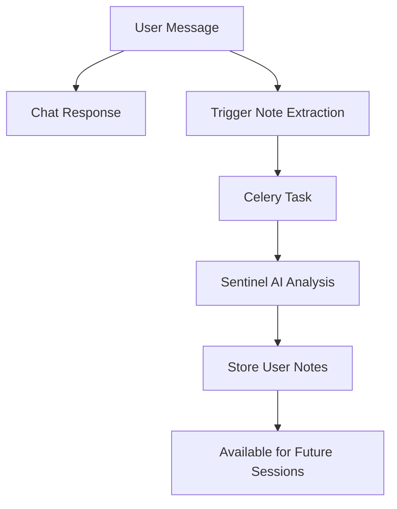

# Sentinel Memory System

The Sentinel Memory System provides long-term, evolving memory for the Discovita Dev Coach chatbot. It automatically extracts and stores important information about users as they interact with the chatbot, enabling the coach to remember key facts and context across sessions.

## Purpose

The Sentinel system serves as the "memory" component of the coaching system, ensuring that:

- **Important user information** is captured and retained across sessions
- **Chat responses remain fast** by processing notes asynchronously
- **Coaching becomes more personalized** as the system learns about each user
- **Context is maintained** throughout the user's coaching journey

## How It Works

### 1. Automatic Note Extraction

When a user sends a message, the system automatically triggers a background process that:

1. **Analyzes the message** using an AI model (the "Sentinel")
2. **Extracts relevant information** about the user
3. **Stores it as structured notes** in the database
4. **Makes it available** for future coaching sessions

### 2. Asynchronous Processing

The note extraction runs asynchronously using Celery to keep the chat endpoint fast:

### 3. Integration with Coaching

The extracted notes are automatically included in every coaching prompt, providing the AI with:

- **User background information**
- **Previous goals and preferences**
- **Important life events or circumstances**
- **Coaching progress and insights**

## Key Components

### Sentinel Service

The core service that analyzes messages and extracts notes. Located in `server/services/sentinel/sentinel.py`.

### Sentinel Prompts

Sentinel prompts are stored in the same [Prompt table](../../database/models/prompt) as all other system prompts, but with a special `prompt_type` of `SENTINEL`. These prompts control how the Sentinel AI analyzes messages and extracts user information.

> **Note**: Sentinel prompts are not available for editing through the main frontend interface. They are managed directly in the database and are specifically designed for the Sentinel system's note extraction functionality.

### User Notes

Structured notes about users stored in the database. For detailed information about the UserNote model, see the [User Notes documentation](../../database/models/user-note).

### Celery Task

Background task that processes new messages and updates notes. Located in `server/apps/user_notes/tasks.py`.

### Django Signal

Automatically triggers note extraction when new user messages are saved. Located in `server/apps/user_notes/signals.py`.

## Sentinel-Only Actions

The Sentinel system uses three specific actions that are not available to the main coaching AI:

- **[Add User Note](../action-handler/actions/add-user-note)** - Creates new user notes from extracted information
- **[Update User Note](../action-handler/actions/update-user-note)** - Updates existing user notes with new information
- **[Delete User Note](../action-handler/actions/delete-user-note)** - Removes outdated or incorrect user notes

These actions are marked as "Sentinel Only" in the Action Handler documentation and are used exclusively by the Sentinel system to maintain the user's memory.

## Benefits

- **Performance**: Chat responses remain fast by processing notes asynchronously
- **Memory**: Important information is retained across sessions
- **Personalization**: Coaching becomes more tailored to each user
- **Scalability**: Background processing doesn't impact user experience
- **Maintainability**: Decoupled architecture makes the system easy to modify

## Integration Points

- **Chat Messages**: Triggers note extraction on new user messages
- **Prompt Manager**: Includes notes in coaching prompts
- **User Notes**: Stores and retrieves user information
- **Action Handler**: Processes note creation/updates

## Related Documentation

- [User Notes Model](../../database/models/user-note) - Database structure for storing user notes
- [Chat Messages API](../../api/endpoints/chat-messages) - How messages are processed
- [Prompt Manager Overview](../prompt-manager/overview) - How notes are included in prompts
- [Action Handler Overview](../action-handler/overview) - How note actions are processed
