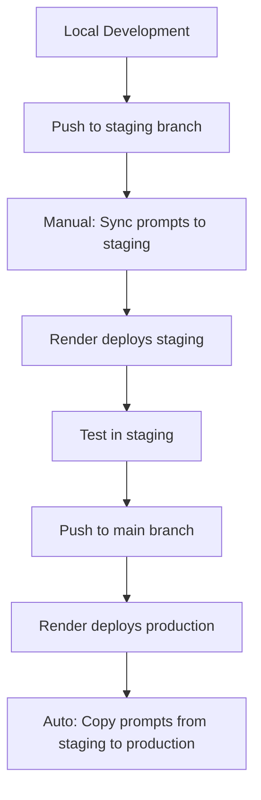

# Deployment Process

This document outlines the complete deployment process for the Dev Coach application, including staging and production environments with prompt synchronization.

## Overview

The Dev Coach deployment process is designed to ensure prompt-code synchronization across environments. The system uses a two-step process for staging deployments and an automated process for production deployments.

## Architecture

### Environments

| Environment | Purpose | Database | Deployment Trigger | Prompt Sync |
|-------------|---------|----------|-------------------|--------------|
| **Local** | Development | Local PostgreSQL | Manual | N/A |
| **Staging** | Testing & Validation | Remote Render PostgreSQL | Push to `staging` branch | Manual |
| **Production** | Live Application | Remote Render PostgreSQL | Push to `main` branch | Automated |

### Deployment Flow



## Prerequisites

### Local Development Environment

Before deploying, ensure your local development environment is running:

```bash
# Start local development environment
COMPOSE_PROJECT_NAME=dev-coach-local \
  docker compose --profile local \
  -f docker/docker-compose.yml \
  -f docker/docker-compose.local.yml up --build -d
```

**Required Services:**
- ✅ Docker Desktop running
- ✅ `dev-coach-local` containers running
- ✅ Local database accessible
- ✅ Backend container accessible

## Staging Deployment Process

### Step 1: Code Deployment

**Trigger:** Push to `staging` branch

**What happens:**
1. Render detects the push to `staging` branch
2. Render runs the staging build script: `./server/scripts/render/render_build_staging.sh`
3. Build script executes:
   - Install Python dependencies
   - Run database migrations
   - Collect static files
   - **Note:** Prompts are NOT copied during this step

### Step 2: Prompt Synchronization (Manual)

**Required:** Local development environment must be running

**Command:**
```bash
# From the project root directory (NOT inside Docker container)
python manage.py copy_prompts_to_staging --force
```

**What this does:**
1. ✅ Checks Docker daemon is running
2. ✅ Verifies `dev-coach-local` container is accessible
3. ✅ Exports all prompts from local database
4. ✅ Connects to staging database
5. ✅ **Completely overwrites** staging prompts table
6. ✅ Imports all local prompts to staging

**Safety Features:**
- Requires `--force` flag to confirm overwrite
- Shows confirmation prompt: "This will OVERWRITE all prompts in staging"
- Validates database connections before proceeding
- Provides detailed logging of all operations

### Step 3: Validation

After deployment and prompt sync:

1. **Test the staging environment**
2. **Verify all prompts work correctly**
3. **Check that no runtime errors occur**
4. **Validate coaching phases function properly**

## Production Deployment Process

### Step 1: Code Deployment

**Trigger:** Push to `main` branch

**What happens:**
1. Render detects the push to `main` branch
2. Render runs the production build script: `./server/scripts/render/render_build_production.sh`
3. Build script executes:
   - Install Python dependencies
   - Run database migrations
   - Collect static files
   - **Automatically copy prompts from staging to production**

### Step 2: Automatic Prompt Synchronization

**Command executed by Render:**
```bash
python manage.py copy_prompts_to_production --force
```

**What this does:**
1. ✅ Connects to staging database
2. ✅ Exports all prompts from staging
3. ✅ Connects to production database
4. ✅ **Completely overwrites** production prompts table
5. ✅ Imports all staging prompts to production

**Safety Features:**
- Requires `--force` flag to confirm overwrite
- Shows confirmation prompt: "This will OVERWRITE all prompts in production"
- Validates database connections before proceeding
- Provides detailed logging of all operations

## Build Scripts

### Staging Build Script (`server/scripts/render/render_build_staging.sh`)

```bash
#!/bin/bash
# Render Build Script for Dev Coach - STAGING
# This script handles staging deployment and prompt synchronization

set -e  # Exit on any error

echo "🚀 Starting Render build process for Dev Coach - STAGING..."

# Function to log with timestamp
log() {
    echo "[$(date '+%Y-%m-%d %H:%M:%S')] $1"
}

# Function to run command with error handling
run_command() {
    local description="$1"
    local command="$2"
    
    log "🔄 $description..."
    if eval "$command"; then
        log "✅ $description completed successfully"
        return 0
    else
        log "❌ $description failed"
        return 1
    fi
}

# Main build process for staging
main() {
    log "🏗️  Starting Dev Coach STAGING build process..."
    
    # Step 1: Install dependencies
    if ! run_command "Installing Python dependencies" "pip install -r server/requirements.txt"; then
        log "❌ Failed to install dependencies - stopping build"
        exit 1
    fi
    
    # Step 2: Run database migrations
    if ! run_command "Running database migrations" "cd server && python manage.py migrate"; then
        log "❌ Failed to run migrations - stopping build"
        exit 1
    fi
    
    # Step 3: Collect static files
    if ! run_command "Collecting static files" "cd server && python manage.py collectstatic --noinput"; then
        log "❌ Failed to collect static files - stopping build"
        exit 1
    fi
    
    # Step 4: Staging deployment complete    
    log "🎉 STAGING build process completed successfully!"
    log "🚀 Dev Coach STAGING is ready to deploy!"
    log "🔄 Note: Prompts are not copied to staging during this build process. You'll need to transfer them manually by running the following command:"
    log "🔄 python manage.py copy_prompts_to_staging --force"
}

# Run main function
main "$@"
```

### Production Build Script (`server/scripts/render/render_build_production.sh`)

```bash
#!/bin/bash
# Render Build Script for Dev Coach - PRODUCTION
# This script handles production deployment and prompt synchronization

set -e  # Exit on any error

echo "🚀 Starting Render build process for Dev Coach - PRODUCTION..."

# Function to log with timestamp
log() {
    echo "[$(date '+%Y-%m-%d %H:%M:%S')] $1"
}

# Function to run command with error handling
run_command() {
    local description="$1"
    local command="$2"
    
    log "🔄 $description..."
    if eval "$command"; then
        log "✅ $description completed successfully"
        return 0
    else
        log "❌ $description failed"
        return 1
    fi
}

# Main build process for production
main() {
    log "🏗️  Starting Dev Coach PRODUCTION build process..."
    
    # Step 1: Install dependencies
    if ! run_command "Installing Python dependencies" "pip install -r server/requirements.txt"; then
        log "❌ Failed to install dependencies - stopping build"
        exit 1
    fi
    
    # Step 2: Run database migrations
    if ! run_command "Running database migrations" "cd server && python manage.py migrate"; then
        log "❌ Failed to run migrations - stopping build"
        exit 1
    fi
    
    # Step 3: Collect static files
    if ! run_command "Collecting static files" "cd server && python manage.py collectstatic --noinput"; then
        log "❌ Failed to collect static files - stopping build"
        exit 1
    fi
    
    # Step 4: Copy prompts from staging to production
    log "📋 Starting prompt synchronization for PRODUCTION (from STAGING)..."
    if run_command "Copy prompts from staging to production" "cd server && python manage.py copy_prompts_to_production --force"; then
        log "✅ Production prompts updated successfully from staging"
    else
        log "⚠️  Production prompt copy failed, but continuing deployment"
    fi
    
    log "🎉 PRODUCTION build process completed successfully!"
    log "🚀 Dev Coach PRODUCTION is ready to deploy!"
}

# Run main function
main "$@"
```

## Management Commands

### Copy Prompts to Staging

**Location:** `server/apps/prompts/management/commands/copy_prompts_to_staging.py`

**Usage:**
```bash
python manage.py copy_prompts_to_staging [--dry-run] [--force]
```

**Options:**
- `--dry-run`: Test the command without making changes
- `--force`: Required to confirm overwrite of staging prompts

**Prerequisites:**
- Local development environment running
- Docker daemon accessible
- `dev-coach-local` container running
- Staging database credentials configured

### Copy Prompts to Production

**Location:** `server/apps/prompts/management/commands/copy_prompts_to_production.py`

**Usage:**
```bash
python manage.py copy_prompts_to_production [--dry-run] [--force]
```

**Options:**
- `--dry-run`: Test the command without making changes
- `--force`: Required to confirm overwrite of production prompts

**Prerequisites:**
- Staging database accessible
- Production database credentials configured

## Render Configuration

### Staging Environment

**Build Command:** `./server/scripts/render/render_build_staging.sh`

**Environment Variables:**
- `STAGING_DB_NAME`
- `STAGING_DB_USER`
- `STAGING_DB_PASSWORD`
- `STAGING_DB_HOST`
- `STAGING_DB_PORT`

### Production Environment

**Build Command:** `./server/scripts/render/render_build_production.sh`

**Environment Variables:**
- `STAGING_DB_NAME`
- `STAGING_DB_USER`
- `STAGING_DB_PASSWORD`
- `STAGING_DB_HOST`
- `STAGING_DB_PORT`
- `PROD_DB_NAME`
- `PROD_DB_USER`
- `PROD_DB_PASSWORD`
- `PROD_DB_HOST`
- `PROD_DB_PORT`

## Deployment Order Considerations

### Staging Deployment Order

**Recommended Order:**
1. **Deploy code first** (Render build script)
2. **Sync prompts second** (Manual command)

**Rationale:**
- Code deployment is fast and can be rolled back quickly
- Prompt sync requires local environment access
- If prompt sync fails, code is already deployed and functional
- Staging environment will be "down" briefly during prompt sync

### Production Deployment Order

**Automated Order:**
1. **Deploy code** (Render build script)
2. **Sync prompts** (Automatic via build script)

**Rationale:**
- Both operations happen in the same build process
- Staging prompts are already validated
- Production deployment is atomic

## Troubleshooting

### Common Issues

#### Docker Environment Not Running
**Error:** `Docker daemon is not running or not accessible!`

**Solution:**
```bash
# Start Docker Desktop
# Then start local environment
COMPOSE_PROJECT_NAME=dev-coach-local \
  docker compose --profile local \
  -f docker/docker-compose.yml \
  -f docker/docker-compose.local.yml up --build -d
```

#### Container Not Accessible
**Error:** `dev-coach-local container is not running!`

**Solution:**
```bash
# Check container status
docker ps --filter "name=dev-coach-local"

# Restart if needed
COMPOSE_PROJECT_NAME=dev-coach-local \
  docker compose --profile local \
  -f docker/docker-compose.yml \
  -f docker/docker-compose.local.yml restart backend
```

#### Database Connection Failed
**Error:** `could not translate host name "db" to address`

**Solution:**
- Ensure local development environment is running
- Check database container is accessible
- Verify environment variables are correct

### Validation Commands

#### Test Local Environment
```bash
# Check Docker daemon
docker info

# Check containers
docker ps --filter "name=dev-coach-local"

# Test backend access
docker exec dev-coach-local-backend-1 python --version
```

#### Test Prompt Sync (Dry Run)
```bash
# Test staging sync
python manage.py copy_prompts_to_staging --dry-run

# Test production sync
python manage.py copy_prompts_to_production --dry-run
```

## Future Improvements

### Optimized Deployment Strategy

**Current Issue:** All services redeploy on any change

**Proposed Solution:** Directory-based deployment triggers

**Implementation:**
1. **Frontend Changes:** Only deploy frontend services
2. **Backend Changes:** Only deploy backend services
3. **Database Changes:** Only run migrations
4. **Documentation Changes:** Only deploy docs

**Benefits:**
- Faster deployments
- Reduced resource usage
- More targeted testing
- Better change tracking

### Automated Staging Prompt Sync

**Current Limitation:** Manual prompt sync for staging

**Proposed Solution:** GitHub Actions workflow

**Implementation:**
1. **Trigger:** Push to staging branch
2. **Action:** Run prompt sync command
3. **Validation:** Test staging environment
4. **Notification:** Report success/failure

**Benefits:**
- Fully automated staging deployment
- Consistent prompt synchronization
- Reduced manual steps
- Better error handling

## Best Practices

### Before Deployment

1. **Test locally** with all changes
2. **Run migrations** if database changes
3. **Validate prompts** work correctly
4. **Check environment** is running

### During Deployment

1. **Monitor build logs** for errors
2. **Verify prompt sync** completed successfully
3. **Test staging environment** after deployment
4. **Validate all coaching phases** work

### After Deployment

1. **Test production environment** thoroughly
2. **Monitor for runtime errors**
3. **Verify prompt functionality**
4. **Check user experience**

## Related Documentation

- [Common Commands](./common-commands.md) - Development commands
- [Docker Configuration](./docker-configuration.md) - Environment setup
- [Prompt Manager System](../core-systems/prompt-manager/overview) - Prompt system details
- [Action Handler System](../core-systems/action-handler/overview) - Action system details
