# Preview Environments

Every PR can spawn its own ephemeral copy of the entire stack — Django API, Celery worker, React frontend, Docusaurus docs, Postgres, Redis — running on Render. The preview is seeded from staging data so you can log in as real users, hit real endpoints, and verify a change end-to-end before merging.

## TL;DR

1. Open a PR with `[render preview]` somewhere in the title.
2. Make sure the PR changes at least one file inside `server/`, `client/`, or `docs/` (a render.yaml-only diff will not trigger a preview).
3. Wait ~5–8 minutes. The PR's "Deployments" sidebar on GitHub will populate with five `preview-coach-* PR #N` URLs.
4. Use `https://preview-coach-frontend-pr-N.onrender.com` to hit the app. Log in with any user from staging (e.g. `superadmin@admin.com` if you have its password).

That's it for the happy path. The rest of this page covers what's actually happening, how to debug a stuck preview, and the one-time setup the workspace already has in place.

## What gets cloned

```mermaid
graph TD
    PR[PR with &#91;render preview&#93;] --> Render[Render reads render.yaml]
    Render --> API[preview-coach-api PR #N]
    Render --> Sentinel[preview-coach-sentinel PR #N<br/>Celery worker]
    Render --> Frontend[preview-coach-frontend PR #N<br/>React/Vite]
    Render --> Docs[preview-coach-docs PR #N<br/>Docusaurus]
    Render --> DB[preview-coach-database PR #N<br/>Postgres 17, basic-1gb]
    Render --> Redis[preview-coach-redis PR #N<br/>Valkey]
    API --> DB
    API --> Redis
    Sentinel --> DB
    Sentinel --> Redis
    Staging[(staging-coach-database)] -.pg_dump.-> DB
```



The blueprint that defines all of this is `render.yaml` at the repo root.

## Triggering a preview

Render's **Preview Environments** feature is gated by two things:

- **PR title** must contain `[render preview]` (case-insensitive). The square brackets and the word `preview` matter — `[preview]` alone won't fire.
- **PR diff** must touch at least one file inside a service `rootDir` (`server/`, `client/`, or `docs/`). Changes to `render.yaml`, `README.md`, or other root-level files alone are silently ignored by Render's PR-detection logic.

If you want a preview for a docs-only or render.yaml-only change, add a no-op edit to a file inside one of those directories (a comment is fine). Subsequent pushes to the same PR redeploy the existing preview environment in place.

## Finding the preview URLs

Once the build kicks off:

1. On the GitHub PR page, scroll to the **Deployments** section in the right sidebar.
2. Each service exposes a "View deployment" link.
3. The frontend is the one you usually want: `https://preview-coach-frontend-pr-N.onrender.com`.
4. The API base is `https://preview-coach-api-pr-N.onrender.com/api/v1/`.

The frontend is built with `VITE_COACH_BASE_URL` baked in, pointing at the matching API host. You don't need to configure anything client-side.

## Lifecycle

| Event                       | What happens                                                                |
| --------------------------- | --------------------------------------------------------------------------- |
| PR opened with the tag      | Render clones every resource, restores staging data, deploys all 5 services |
| Push to PR branch           | Render redeploys the API/sentinel/frontend/docs in place; DB is **kept**    |
| PR closed (merged or not)   | Render destroys the entire preview environment, including the DB           |

> **Important:** the preview DB is **not** reset on each push. If your migration touches existing rows, the second deploy sees the post-migration state, not a fresh staging dump. Close and reopen the PR if you need a fresh DB.

Cost-wise, each active preview runs ~$12/month prorated by uptime (1gb Postgres + starter web/worker + small static + Redis). Only PRs you actively tag get billed.

## What the API service does on first deploy

The interesting work happens in `preDeployCommand` in `render.yaml`:

```bash
wait_for_db                              # Postgres takes 1–2 min to accept connections
if [ "$RENDER_GIT_BRANCH" != "main" ]; then
  pg_dump "$STAGING_DB_URL" ...          # dump staging to a file
  psql "$PREVIEW_DATABASE_URL" -f ...    # restore into the preview DB
  wait_for_db                            # restore briefly knocks the DB offline
fi
python manage.py migrate --noinput       # apply any new migrations from this PR's code
```

A few details that surprise people:

- The dump is gated on `RENDER_GIT_BRANCH != "main"`. The base `preview-coach-api` service (which is just a template, never serves traffic) deploys from `main` and skips the dump. PR-spawned previews deploy their PR branch and run the dump.
- We **do not** use `RENDER_GIT_PR_NUMBER` for this gate. That env var is only set by the older per-service Pull Request Previews feature; Render's top-level Preview Environments do **not** populate it.
- The dump is buffered through a file (`/tmp/staging-dump.sql`). Streaming `pg_dump | psql` directly held two SSL connections open simultaneously and dropped one mid-transfer reliably enough to make it unusable.
- The preview DB is provisioned at `basic-1gb` (`previewPlan` in `render.yaml`), not the base service's `basic-256mb`. The dump OOMs on 256mb.
- Migrations from your PR branch run *after* the staging restore, so a PR that adds a new migration will apply it on top of staging data — exactly what you want for testing.

## Logging in

The preview DB is a copy of staging at the moment of the restore. Any user that exists in staging exists in the preview, including their hashed passwords.

- `superadmin@admin.com` is provisioned in staging as a Django superuser. Use the password the team stores in the password manager.
- Previews share the staging S3 bucket (`discovita-dev-coach-staging`) but each preview gets its own per-PR prefix (`previews/pr-N/media/`), so uploads in one preview don't pollute another or staging itself.

## Troubleshooting

### "I added `[render preview]` to the title and nothing happened"

Check that the PR diff touches a file inside `server/`, `client/`, or `docs/`. Render skips PRs that only touch root-level files. The fix is usually one extra commit that bumps a comment in a service rootDir.

### Deploy logs show `pg_dump: error: connection to server on socket "/var/run/postgresql/.s.PGSQL.5432" failed`

`pg_dump` is falling back to a local Unix socket because `$STAGING_DB_URL` expanded to the empty string. This means the env-group var isn't propagating into the preview's runtime. Check that the dashboard-managed `preview-shared-secrets` env group has `STAGING_DB_URL` populated and is linked to `preview-coach-api`.

### Deploy logs show `COPY 0` for many tables / `psql: SSL error: unexpected eof while reading`

The preview DB is OOM-killed mid-restore. This was the symptom on the old `basic-256mb` plan. Confirm the running preview DB is on `basic_1gb`:

```bash
RENDER_API_KEY=$(awk '/^    key:/ {print $2}' ~/.render/cli.yaml)
curl -sS -H "Authorization: Bearer $RENDER_API_KEY" \
  "https://api.render.com/v1/services?ownerId=tea-ctkbvvaj1k6c73cno5bg&limit=50" \
  | jq '.[] | .postgres? | select(.name | contains("PR #")) | {name, plan, status}'
```

If a preview was opened *before* a `previewPlan` change, its DB stays on the old plan. Close and reopen the PR to get a fresh DB at the new plan.

### Preview deploy succeeds but the DB is empty

Pre-deploy ran in a few seconds (real dumps take ~30–60s). Either:
1. `STAGING_DB_URL` was empty (see the `pg_dump` socket-error case above), or
2. The dump silently failed against a closed connection. Check the deploy log for the actual `pg_dump` / `psql` exit messages — they're noisy but informative.

### "I can't see the PR-spawned services in `render services`"

Known CLI gap — `render services` only lists services in the active workspace's projects, not PR-spawned services from top-level Preview Environments. To find a preview's service IDs:

```bash
gh api 'repos/Discovita/dev-coach/deployments' \
  --jq '.[] | select(.environment | contains("PR #N"))'
```

Each deployment status's `log_url` contains the Render service ID (`srv-xxx`).

### Streaming preview logs

```bash
# Find the API service ID (see above)
render logs --resources srv-xxx --tail
```

Filter to the bits you usually want:

```bash
render logs --resources srv-xxx --tail \
  | grep -E "ENV_CHECK|COPY [0-9]|pg_dump:|psql:|Pre-deploy|service is live"
```

## One-time workspace setup

The workspace already has this configured; this section is for posterity in case the env group is recreated or this deployment moves to a new Render workspace.

### The shared secrets env group

Render's documented quirk: env vars defined with `sync: false` in a blueprint are **not** copied into preview environments. The same is true for env groups *declared in* the blueprint. Only **dashboard-created** env groups propagate.

So `preview-shared-secrets` is created manually in the Render dashboard with these keys:

| Key                              | Value                                                          |
| -------------------------------- | -------------------------------------------------------------- |
| `PYTHON_VERSION`                 | `3.11.10`                                                      |
| `DJANGO_SETTINGS_MODULE`         | `settings.previews`                                            |
| `DJANGO_SECRET_KEY`              | any random string (previews don't need to share with prod)     |
| `STAGING_DB_URL`                 | full `postgres://` URL of `staging-coach-database`             |
| `AWS_ACCESS_KEY_ID`              | same as staging                                                |
| `AWS_SECRET_ACCESS_KEY`          | same as staging                                                |
| `AWS_REGION`                     | `us-east-1`                                                    |
| `AWS_SES_REGION_NAME`            | same as staging                                                |
| `AWS_SES_REGION_ENDPOINT`        | same as staging                                                |
| `AWS_SES_SOURCE_EMAIL`           | same as staging                                                |
| `STAGING_AWS_STORAGE_BUCKET_NAME`| `discovita-dev-coach-staging`                                  |

The blueprint references it via `fromGroup: preview-shared-secrets` in `render.yaml`. You only need to do this once per workspace; subsequent previews inherit it automatically.

> Watch out for key naming: the staging DB URL is keyed `STAGING_DB_URL` (not `STAGING_DATABASE_URL`). The preDeployCommand expects exactly that name. If the names drift, `pg_dump` silently restores nothing.

### Required Render plan

Top-level Preview Environments require a Render Pro plan or higher on the workspace.

## Related Documentation

- [Deployment Process](./deployment-process.md) — Staging and production deploys
- [Common Commands](./common-commands.md) — Local dev commands
- [Docker Configuration](./docker-configuration.md) — Local environment setup
